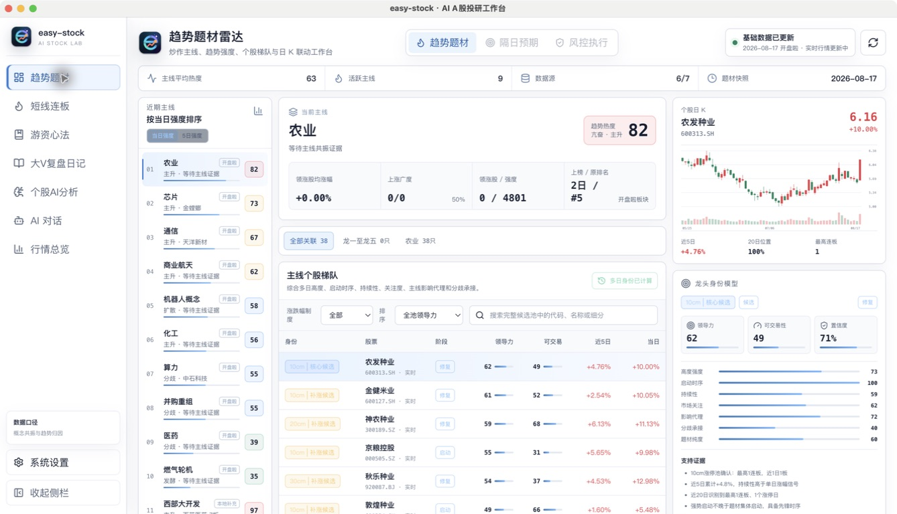
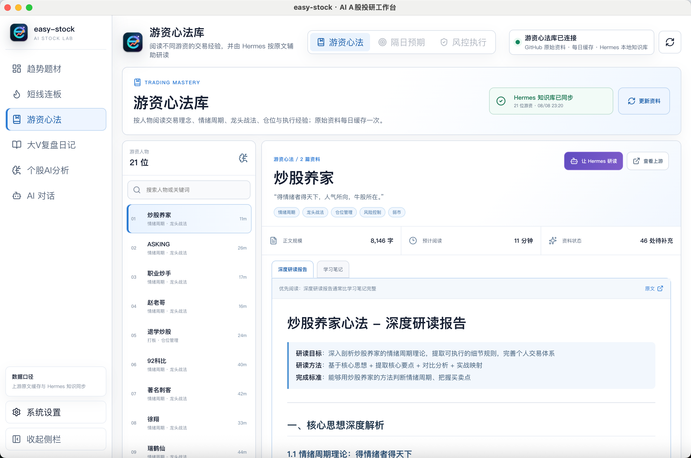

  

<h1 align="center">easy-stock</h1>

<strong>AI 时代的 A 股行情分析与智能投研工作台</strong>

  让 AI 看懂市场，让每一次判断都有证据。 
  把盘中观察、盘后复盘和长期认知，沉淀为一套持续进化的研究系统。

  
  
  
  
  

  <a href="#为什么要做-easy-stock">为什么</a> ·
  <a href="#核心产品能力">核心能力</a> ·
  <a href="#ai-如何赋能-a-股研究">AI 研究方式</a> ·
  <a href="#ai-原生架构">系统架构</a> ·
  <a href="#快速开始">快速开始</a>

---

## 为什么要做 easy-stock

AI 时代的炒股软件，不应该只是在传统行情终端旁边多放一个聊天框。

传统行情软件擅长展示价格、涨跌幅和成交额，但 A 股交易真正困难的是理解价格背后的结构：今天的主线是什么、题材是否扩散、连板高度是否打开、昨日强势股是否获得溢价、趋势是否仍然成立、情绪处于修复还是退潮。

easy-stock 希望构建一套真正理解 A 股语境的 AI 原生工作台：

| AI 原生能力 | easy-stock 的实现方式 |
| --- | --- |
| **感知市场** | 聚合开盘啦、东方财富、新浪、财联社等来源，统一行情、K 线、题材、涨停与资讯数据 |
| **理解结构** | 将趋势、题材、连板、情绪、量价和相对强度整理成可计算的领域模型 |
| **执行任务** | 通过定时调度、内置浏览器和 Agent 自动发现文章、去重、归档并提炼观点 |
| **形成记忆** | 将文章、摘要、情绪历史、分析记录、模型会话和研究缓存保存在本机 |
| **验证结论** | 保留评分维度、题材来源、原文地址、更新时间、延迟与降级状态，让结论可以回到证据层核验 |

> easy-stock 的目标不是替你做决定，而是让你在 AI 时代拥有更完整的感知、更高效的研究和更可复用的判断体系。

---

## 核心产品能力

### 01 · 大 V 自动复盘

#### 兼听则明，客观则赢：让 AI 自动收集和整理多位市场作者的观点

大 V 的盘后复盘通常分散在雪球、淘股吧和微信公众号中，手工逐个打开主页、筛选当天文章、复制正文并整理观点非常耗时。easy-stock 将这些内容组织为统一的复盘时间流：

  

文章收集完成后，可以一键生成「今日大 V 观点共识」，从文章集合中提炼共同关注方向、主要分歧、盘面事实与下一交易日需要验证的条件。

  

这套能力希望解决的不是“让 AI 猜明天涨什么”，而是把几十篇非结构化文章转化为一份可阅读、可核验、可在次日继续跟踪的观点地图。

### 02 · 超短连板分析

#### 看清梯队、晋级和情绪周期，寻找真正的超短节点

系统将涨停池、连板梯队、昨日反馈、晋级率和情绪历史放在同一视图中,并设计一套算法分析情绪周期：

  

### 03 · 趋势题材雷达

#### 从板块涨跌中识别真正的市场主线：牛市进程分歧研究，熊市进程分歧防守
聚合题材排名、涨跌强度、资金流、上涨宽度和持续天数，通过题材地图拆解产业链、概念节点和细分方向。结合 AI 分析市场趋势、题材阶段和趋势股的条件化介入点

  

### 04 · 个股 AI 分析

#### 把趋势股与情绪股放进同一套可解释决策系统

个股 AI 分析会系统判断个股更接近情绪连板、趋势容量、趋势成长、震荡观察还是弱势风险路径，再为不同路径分配不同权重，结合你的个人操作经验，复盘文章，游资心得等差异化内容让ai定制你的专属个股报告。

  

  

截图用于展示页面结构；股票状态、题材标签、评分和风险参数会随交易日、缓存快照与数据源可用性动态变化。

### 05 · 游资心法与 AI Copilot

#### 把经验材料变成可持续研读的知识，让 AI 越用越懂你的研究方式

  

### 每日研究闭环

| 阶段 | easy-stock 提供的能力 |
| --- | --- |
| **盘中发现** | 趋势题材、实时行情、题材地图、涨停梯队和数据源状态 |
| **个股研判** | 路径识别、多周期趋势、相对强度、题材归因、隔日情景和风险边界 |
| **收盘复盘** | 情绪时间轴、昨日反馈、晋级结构和连板梯队分析 |
| **信息收集** | 大 V 主页自动同步、文章导入、正文清洗和本地归档 |
| **AI 提炼** | 单篇摘要、作者归纳、跨作者共识、分歧和明日观察条件 |
| **长期积累** | 文章资料库、游资心法、个股分析记录、AI 会话和本地研究记忆 |

---

## AI 如何赋能 A 股研究

### 1. 从“看数据”升级为“理解市场结构”

easy-stock 先通过领域化数据模型整理题材、梯队、涨停原因、趋势、相对强度和情绪历史，再把这些结构交给 AI 解释。AI 面对的不再是一组孤立数字，而是一套带有 A 股语义的市场证据。

### 2. 从“手工翻网页”升级为“Agent 主动执行”

Hermes 可以配合 agent-browser 和 Electron 持久浏览器会话，按照订阅配置访问雪球或淘股吧主页，发现最新文章，识别作者和发布时间，完成去重、正文抓取、归档与 AI 提炼。

### 3. 从“单篇摘要”升级为“观点网络”

系统先归纳每位作者的核心观点，再汇总当日多位作者的共识与分歧，区分盘面事实、少数预期、共同关注方向和下一交易日需要验证的条件。

### 4. 从“通用问答”升级为“A 股研究 Copilot”

AI 会话统一经过本机 Hermes Runtime。Hermes 负责模型调用、会话续接、工具路由、知识技能和任务上下文，业务代码不直接绑定某一家模型厂商。

目前可以配置 OpenAI、DeepSeek、通义千问、Moonshot、Anthropic，以及兼容 OpenAI 协议的自定义服务。

### 5. 从“用完即走”升级为“长期研究飞轮”

| 感知 | 理解 | 行动 | 记忆 | 验证 |
| --- | --- | --- | --- | --- |
| 获取实时行情、题材和文章 | AI 识别结构、观点和分歧 | 自动同步、分析并生成预案 | 本地保存文章、历史和会话 | 下一交易日用行情与原文验证 |

每一次验证都会成为下一次研究的上下文。随着使用时间增加，软件积累的不只是更多数据，而是一套更贴近使用者的研究流程和认知资产。

---

## AI 原生架构

  

| 层级 | 核心职责 |
| --- | --- |
| **AI 投研体验层** | 趋势题材、短线连板、个股 AI 分析、游资心法、大 V 复盘与 AI Copilot |
| **业务编排层** | Go API、个股分析引擎、策略评估、复盘智能、调度任务和数据源状态 |
| **AI Agent 平台层** | Hermes Prompt、Skills、Session、Memory、Tool Router 与开放模型网关 |
| **数据智能层** | Provider Registry、统一市场模型、题材归因、证据元数据、SQLite 与缓存快照 |
| **外部生态层** | 行情数据源、内容平台、浏览器执行能力和用户选择的大模型服务 |
| **桌面运行边界** | Electron 生命周期、随机端口、一次性 Token、持久浏览器会话和本地资源装配 |
| **安全与治理** | 密钥隔离、来源追踪、弹性降级、运行状态与风险提示 |

---

## 快速开始

### 1. 用户

无需安装 Node.js、Go 或 Python。前往 [GitHub Releases](https://github.com/jundizhou/easy-stock/releases/latest) 下载适合当前系统的桌面安装包或压缩包。

### 2. 开发者

需要从源码运行、调试、测试或打包，请阅读 [开发者文档](./docs/development.md)。

---

## 风险提示

> 本项目仅用于学习、研究和信息整理，不构成任何投资建议、收益承诺或交易依据。市场有风险，AI 输出和第三方数据也可能存在延迟、遗漏或错误，请始终结合原始信息独立判断并自行承担决策结果。

Local first · Evidence based · Human in control

