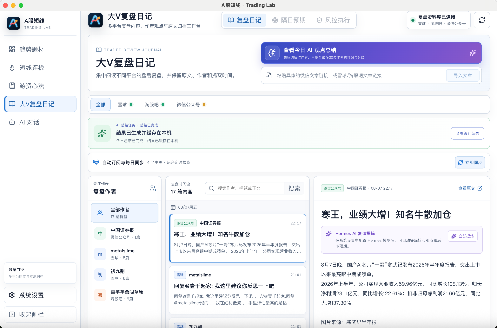
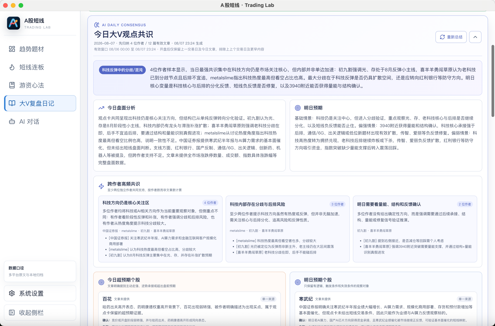
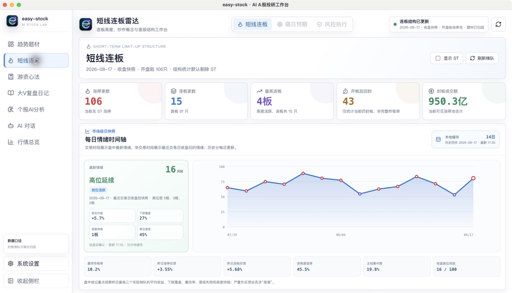
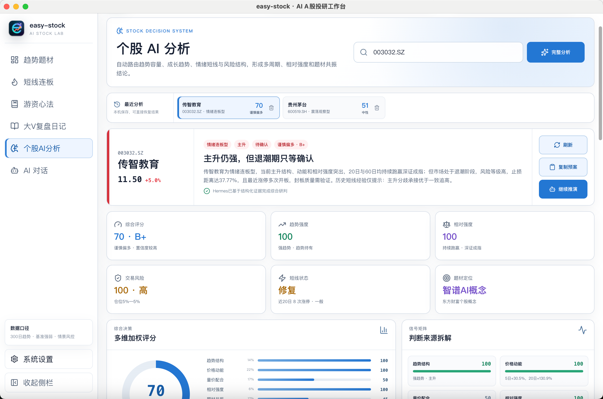
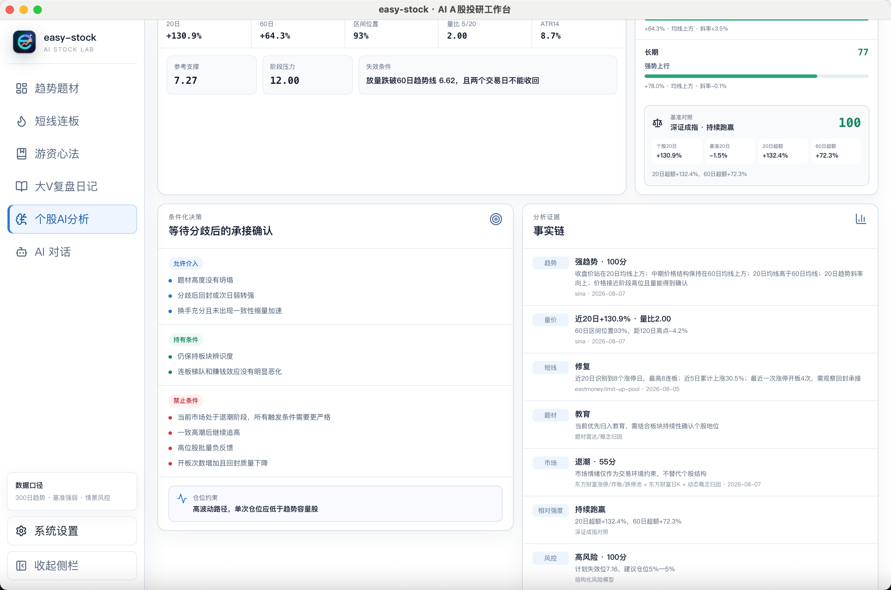
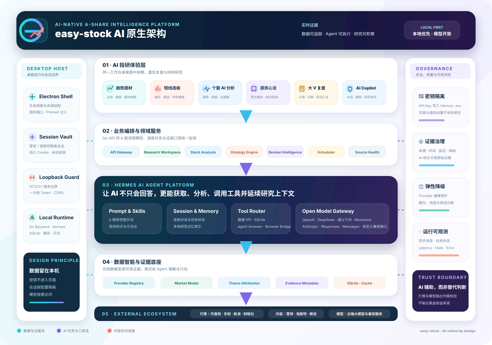

<p align="center">
  
</p>

<h1 align="center">easy-stock</h1>

<p align="center"><strong>AI 时代的 A 股行情分析与智能投研工作台</strong></p>

<p align="center">
  让 AI 看懂市场，让每一次判断都有证据。<br />
  把盘中观察、盘后复盘和长期认知，沉淀为一套持续进化的研究系统。
</p>

<p align="center">
  
  
  
  
  
</p>

<p align="center">
  <a href="#为什么要做-easy-stock">为什么</a> ·
  <a href="#核心产品能力">核心能力</a> ·
  <a href="#ai-如何赋能-a-股研究">AI 研究方式</a> ·
  <a href="#ai-原生架构">系统架构</a> ·
  <a href="#快速开始">快速开始</a>
</p>

---

## 为什么要做 easy-stock

AI 时代的炒股软件，不应该只是在传统行情终端旁边多放一个聊天框。

传统行情软件擅长展示价格、涨跌幅和成交额，但 A 股交易真正困难的是理解价格背后的结构：今天的主线是什么、题材是否扩散、连板高度是否打开、昨日强势股是否获得溢价、趋势是否仍然成立、情绪处于修复还是退潮。

### 投资理念

| 短线 | 趋势 |
| --- | --- |
| 捕捉市场拐点。真正的赚钱效应往往出现在风格转化，真正的亏钱效应往往发生在情绪延续。永远保持先手，永远敬畏市场。 | 上升趋势中，可买可不买时要敢于研究和参与；下降趋势中，徘徊做与不做时选择不做。领军地位的股票可做可不做时勇敢去做，后排跟风可做可不做时选择放弃。 |

easy-stock 希望构建一套真正理解 A 股语境的 AI 原生工作台：

| AI 原生能力 | easy-stock 的实现方式 |
| --- | --- |
| **感知市场** | 聚合开盘啦、东方财富、新浪、财联社等来源，统一行情、K 线、题材、涨停与资讯数据 |
| **理解结构** | 将趋势、题材、连板、情绪、量价和相对强度整理成可计算的领域模型 |
| **执行任务** | 通过定时调度、内置浏览器和 Agent 自动发现文章、去重、归档并提炼观点 |
| **形成记忆** | 将文章、摘要、情绪历史、分析记录、模型会话和研究缓存保存在本机 |
| **验证结论** | 保留评分维度、题材来源、原文地址、更新时间、延迟与降级状态，让结论可以回到证据层核验 |

> easy-stock 的目标不是替你做决定，而是让你在 AI 时代拥有更完整的感知、更高效的研究和更可复用的判断体系。

---

## 核心产品能力

### 01 · 大 V 自动复盘

#### 兼听则明，客观则赢：让 AI 自动收集和整理多位市场作者的观点

大 V 的盘后复盘通常分散在雪球、淘股吧和微信公众号中，手工逐个打开主页、筛选当天文章、复制正文并整理观点非常耗时。easy-stock 将这些内容组织为统一的复盘时间流：

- 支持雪球、淘股吧和微信公众号三类内容入口
- 雪球、淘股吧支持作者主页订阅与每日定时自动同步
- 自动识别作者、标题、发布时间和原文链接，并保存在本机
- 每篇文章可以交给 Hermes AI 提炼摘要、关键点、关联方向和后市预期

<p align="center">
  
</p>

文章收集完成后，可以一键生成「今日大 V 观点共识」，从文章集合中提炼共同关注方向、主要分歧、盘面事实与下一交易日需要验证的条件。

<p align="center">
  
</p>

这套能力希望解决的不是“让 AI 猜明天涨什么”，而是把几十篇非结构化文章转化为一份可阅读、可核验、可在次日继续跟踪的观点地图。

### 02 · 超短连板分析

#### 看清梯队、晋级和情绪周期，寻找真正的超短节点

系统将涨停池、连板梯队、昨日反馈、晋级率和情绪历史放在同一视图中：

- 展示涨停家数、连板家数、最高连板、开板回封和封板成交额
- 按高度整理首板、二板及更高梯队，并展示逐股炒作题材和板型
- 跟踪昨日涨停、昨日连板与高标股票的真实溢价
- 统计 `1进2`、`2进3` 等晋级率，识别扩张、分化、修复与退潮
- 开盘啦优先提供当日涨停和逐股题材，东方财富补充历史结构与行情字段

<p align="center">
  
</p>

页面不仅展示结果，也解释赚钱效应来自哪个梯队、风险集中在高位还是后排，以及昨日强势股是否真正兑现了溢价。

### 03 · 趋势题材雷达

#### 从板块涨跌中识别真正的市场主线：牛市进程分歧研究，熊市进程分歧防守

- 聚合题材排名、涨跌强度、资金流、上涨宽度和持续天数
- 保留开盘啦题材排名和龙一至龙五归因，并补充完整候选股池
- 通过题材地图拆解产业链、概念节点和细分方向
- 联动实时行情、日 K、近五日表现和领导力指标
- 结合 AI 分析市场趋势、题材阶段和趋势股的条件化买卖点
- 主数据源不可用时，明确展示缓存沿用、兜底来源和降级原因

### 04 · 个股 AI 分析

#### 把趋势股与情绪股放进同一套可解释决策系统

个股 AI 分析位于主工作台一级入口，与 AI 对话并列。输入股票代码后，系统先判断个股更接近情绪连板、趋势容量、趋势成长、震荡观察还是弱势风险路径，再为不同路径分配不同权重，而不是用同一套模板解释所有股票。

- 读取最多 300 个交易日的日 K，分析 MA20、MA60、MA120、趋势斜率、区间位置、回撤、量比和 ATR
- 同时计算短期、中短期、中期、长中期和长期五个周期，观察价格与均线是否形成共振
- 自动选择上证、深证、创业板、科创板或北证指数作为相对强度基准
- 识别近 20 日涨停次数、最高连板、最近开板次数、换手和成交容量
- 将趋势结构、价格动能、量价配合、相对强度、题材共振、市场环境和风险约束汇总为多维评分
- 输出允许介入、持有、禁止条件和结构失效位，并生成高开、平开、低开、破位四类隔日情景
- 保存最近分析记录，可以快速切换个股、复制交易预案或继续交给 AI 推演
- Hermes 只负责基于结构化事实生成综合表述，不会改写本地引擎计算出的价格、分数和风控边界

<p align="center">
  
</p>

#### 连板股与趋势股采用不同的题材归因路线

题材定位会先判断个股当前的交易路径，再决定数据源优先级，避免让“教育”“软件服务”等宽泛行业覆盖真正参与市场交易的细分题材。

| 个股路径 | 题材归因优先级 |
| --- | --- |
| **情绪连板 / 短线修复** | 开盘啦短线连板逐股题材 → 开盘啦题材领涨归因 → 精确涨停事件 → 趋势题材雷达 → 东方财富个股概念 → 宽泛行业 |
| **趋势容量 / 趋势成长** | 开盘啦趋势题材领涨归因 → 趋势题材雷达匹配 → 相关连板池题材 → 东方财富个股概念 → 宽泛行业 |

每次分析都会返回题材来源、数据日期和命中证据。开盘啦缓存没有该股票时，界面会明确提示已经降级使用东方财富个股概念；只有具体概念也不可用时，才使用行业分类兜底。

<p align="center">
  
</p>

<p align="center"><sub>截图用于展示页面结构；股票状态、题材标签、评分和风险参数会随交易日、缓存快照与数据源可用性动态变化。</sub></p>

### 05 · 游资心法与 AI Copilot

#### 把经验材料变成可持续研读的知识，让 AI 越用越懂你的研究方式

- 每日缓存公开的游资心法原始资料并按交易者建立索引
- 将本地资料同步为 Hermes 可使用的知识技能和记忆索引
- AI 回答时区分原文观点、模型推断和风险，不把历史经验包装为事实
- 支持 Hermes 流式对话、多轮会话续接和本机历史记录
- 支持 OpenAI、DeepSeek、通义千问、Moonshot、Anthropic 和兼容接口
- 心法研读、文章提炼、每日观点总结和通用研究对话共享同一模型底座

### 每日研究闭环

| 阶段 | easy-stock 提供的能力 |
| --- | --- |
| **盘中发现** | 趋势题材、实时行情、题材地图、涨停梯队和数据源状态 |
| **个股研判** | 路径识别、多周期趋势、相对强度、题材归因、隔日情景和风险边界 |
| **收盘复盘** | 情绪时间轴、昨日反馈、晋级结构和连板梯队分析 |
| **信息收集** | 大 V 主页自动同步、文章导入、正文清洗和本地归档 |
| **AI 提炼** | 单篇摘要、作者归纳、跨作者共识、分歧和明日观察条件 |
| **长期积累** | 文章资料库、游资心法、个股分析记录、AI 会话和本地研究记忆 |

---

## AI 如何赋能 A 股研究

### 1. 从“看数据”升级为“理解市场结构”

easy-stock 先通过领域化数据模型整理题材、梯队、涨停原因、趋势、相对强度和情绪历史，再把这些结构交给 AI 解释。AI 面对的不再是一组孤立数字，而是一套带有 A 股语义的市场证据。

### 2. 从“手工翻网页”升级为“Agent 主动执行”

Hermes 可以配合 agent-browser 和 Electron 持久浏览器会话，按照订阅配置访问雪球或淘股吧主页，发现最新文章，识别作者和发布时间，完成去重、正文抓取、归档与 AI 提炼。

### 3. 从“单篇摘要”升级为“观点网络”

系统先归纳每位作者的核心观点，再汇总当日多位作者的共识与分歧，区分盘面事实、少数预期、共同关注方向和下一交易日需要验证的条件。

### 4. 从“通用问答”升级为“A 股研究 Copilot”

AI 会话统一经过本机 Hermes Runtime。Hermes 负责模型调用、会话续接、工具路由、知识技能和任务上下文，业务代码不直接绑定某一家模型厂商。

目前可以配置 OpenAI、DeepSeek、通义千问、Moonshot、Anthropic，以及兼容 OpenAI 协议的自定义服务。

### 5. 从“用完即走”升级为“长期研究飞轮”

| 感知 | 理解 | 行动 | 记忆 | 验证 |
| --- | --- | --- | --- | --- |
| 获取实时行情、题材和文章 | AI 识别结构、观点和分歧 | 自动同步、分析并生成预案 | 本地保存文章、历史和会话 | 下一交易日用行情与原文验证 |

每一次验证都会成为下一次研究的上下文。随着使用时间增加，软件积累的不只是更多数据，而是一套更贴近使用者的研究流程和认知资产。

---

## AI 原生架构

<p align="center">
  
</p>

| 层级 | 核心职责 |
| --- | --- |
| **AI 投研体验层** | 趋势题材、短线连板、个股 AI 分析、游资心法、大 V 复盘与 AI Copilot |
| **业务编排层** | Go API、个股分析引擎、策略评估、复盘智能、调度任务和数据源状态 |
| **AI Agent 平台层** | Hermes Prompt、Skills、Session、Memory、Tool Router 与开放模型网关 |
| **数据智能层** | Provider Registry、统一市场模型、题材归因、证据元数据、SQLite 与缓存快照 |
| **外部生态层** | 行情数据源、内容平台、浏览器执行能力和用户选择的大模型服务 |
| **桌面运行边界** | Electron 生命周期、随机端口、一次性 Token、持久浏览器会话和本地资源装配 |
| **安全与治理** | 密钥隔离、来源追踪、弹性降级、运行状态与风险提示 |

---

## 快速开始

### 环境要求

- Node.js 与 npm
- Go 1.26（以后端 `go.mod` 为准）
- AI 功能需要 Hermes Runtime 和可用的模型 API Key
- macOS 桌面打包需要 Electron 对应架构的运行环境

### 安装并启动 Web 工作台

```bash
git clone <your-repository-url>
cd easy-stock
npm install
npm run restart
```

默认地址：

| 服务 | 地址 |
| --- | --- |
| 前端 | `http://127.0.0.1:20073` |
| 后端 | `http://127.0.0.1:20081` |
| 日志 | `.runtime/` |

<details>
<summary><strong>分别启动前后端</strong></summary>

```bash
# 终端 1
npm run dev:backend
```

```bash
# 终端 2
VITE_A_STOCK_BACKEND_URL=http://127.0.0.1:20081 npm run dev:frontend
```

</details>

<details>
<summary><strong>启动 Electron 桌面应用</strong></summary>

```bash
# 终端 1：Vite 页面
npm run dev:frontend
```

```bash
# 终端 2：Electron 桌面端
npm run dev:desktop
```

Electron 会自动分配本机端口、生成一次性 Token 并启动 Go 后端，不需要手动维护服务进程。

</details>

### 配置 Hermes 与模型

开发环境可以指定已经准备好的 Hermes Runtime：

```bash
export A_STOCK_HERMES_RUNTIME_ROOT=/absolute/path/to/hermes-runtime
export A_STOCK_HERMES_HOME="$PWD/.runtime/hermes-home"
export A_STOCK_HERMES_WORKDIR="$PWD/.runtime/hermes-workspace"
```

随后在应用的「设置 → 模型服务」中选择服务商、填写模型名称与 API Key，并运行连接测试。模型 API Key 只写入 Hermes 用户目录下的 `.env`，不会保存到前端页面或通用设置文件。

### 核心接口

| 路径 | 说明 |
| --- | --- |
| `GET /api/v1/themes/overview` | 趋势题材总览 |
| `GET /api/v1/short-term/limit-up-ladder` | 涨停与连板梯队 |
| `POST /api/v1/stocks/ai-analysis` | 个股多路径分析、证据链与风险计划 |
| `GET /api/v1/reviews/*` | 文章、订阅、同步与 AI 分析 |
| `GET /api/v1/ai/ws` | Hermes AI 流式会话 |

### 测试与构建

```bash
npm test
```

```bash
cd backend && go test ./...
npm --workspace frontend test -- --run
npm --workspace frontend run build
npm --workspace desktop test
```

---

## 本地优先与安全边界

- Go 后端只监听 loopback，桌面模式使用随机端口和一次性 Token
- 模型 API Key 隔离保存在 Hermes `.env` 中
- 雪球和淘股吧登录态按采集配置隔离并保存在本机
- 文章、行情缓存、AI 会话、个股分析记录和设置默认保存在当前设备
- 数据响应保留来源、时间、延迟、过期和降级信息
- Cookie、API Key、数据库、浏览器状态和 Runtime 目录不应提交到版本控制

## 风险提示

> 本项目仅用于学习、研究和信息整理，不构成任何投资建议、收益承诺或交易依据。市场有风险，AI 输出和第三方数据也可能存在延迟、遗漏或错误，请始终结合原始信息独立判断并自行承担决策结果。

<p align="center"><sub>Local first · Evidence based · Human in control</sub></p>
