

  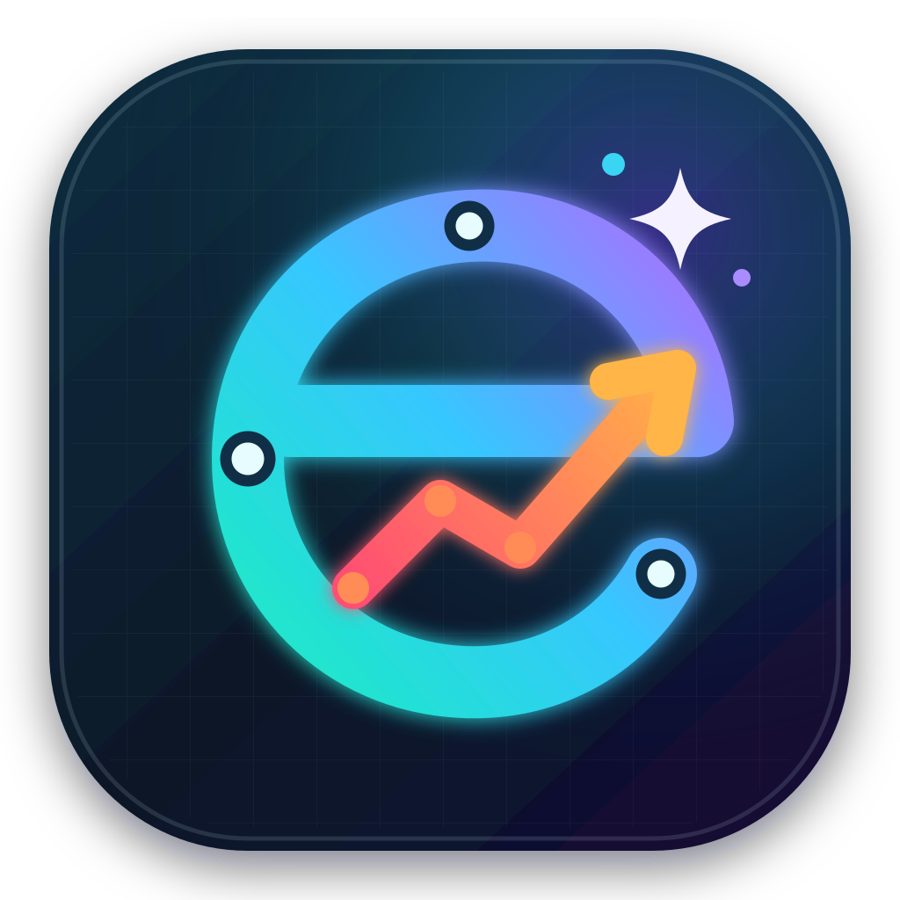

<h1 align="center">easy-stock：A股 AI 智能投研工作台</h1>

<strong>从行情与题材，到个股研究、持仓巡检与 AI 持仓优化</strong>

<a href="./README_EN.md">English</a> | 简体中文

  让 AI 看懂市场，让每一次判断都有证据。 
  把盘中观察、盘后复盘和长期认知，沉淀为一套持续进化的研究系统。

  <a href="https://github.com/jundizhou/easy-stock/releases/latest"><strong>下载最新版</strong></a> ·
  <a href="https://qm.qq.com/q/lizlauc32U"><strong>加入 QQ 群</strong></a> ·
  <a href="#核心产品能力">查看核心能力</a> ·
  <a href="https://github.com/jundizhou/easy-stock/issues/new/choose">反馈问题</a> ·
  <a href="./ROADMAP.md">产品路线图</a>

  
  
  
  
  
  
  
  

<h3 align="center">easy-stock QQ 交流群</h3>

  <a href="https://qm.qq.com/q/lizlauc32U"><strong>点击加入群聊：422158208</strong></a>

  <a href="#为什么要做-easy-stock">为什么</a> ·
  <a href="#核心产品能力">核心能力</a> ·
  <a href="#ai-如何赋能-a-股研究">AI 研究方式</a> ·
  <a href="#ai-原生架构">系统架构</a> ·
  <a href="#快速开始">快速开始</a> ·
  <a href="https://github.com/jundizhou/easy-stock/discussions">社区讨论</a> ·
  <a href="./CONTRIBUTING.md">参与贡献</a> ·
  <a href="#许可与商业使用">许可</a>

---

## 为什么要做 easy-stock

AI 时代的炒股软件，不应该只是在传统行情终端旁边多放一个聊天框。

传统行情软件擅长展示价格、涨跌幅和成交额，但 A股交易真正困难的是理解价格背后的结构：今天的主线是什么、题材是否扩散、连板高度是否打开、昨日强势股是否获得溢价、趋势是否仍然成立、情绪处于修复还是退潮。

easy-stock 希望构建一套真正理解 A股语境的 AI 原生工作台，把行情分析、题材研究、股票分析、盘后复盘与可追溯证据放进同一个本地优先的研究流程：

| AI 原生能力 | easy-stock 的实现方式 |
| --- | --- |
| **感知市场** | 聚合开盘啦、东方财富、新浪、财联社等来源，统一行情、K 线、题材、涨停与资讯数据 |
| **理解结构** | 将趋势、题材、连板、情绪、量价和相对强度整理成可计算的领域模型 |
| **执行任务** | 通过定时调度、内置浏览器和 Agent 自动发现文章、去重、归档并提炼观点 |
| **形成记忆** | 将文章、摘要、情绪历史、分析记录、模型会话和研究缓存保存在本机 |
| **验证结论** | 保留评分维度、题材来源、原文地址、更新时间、延迟与降级状态，让结论可以回到证据层核验 |

> easy-stock 的目标不是替你做决定，而是让你在 AI 时代拥有更完整的感知、更高效的研究和更可复用的判断体系。

---

## 核心产品能力

### 01 · 大 V 自动复盘

#### 兼听则明，客观则赢：让 AI 自动收集和整理多位市场作者的观点

大 V 的盘后复盘通常分散在雪球、淘股吧和微信公众号中，手工逐个打开主页、筛选当天文章、复制正文并整理观点非常耗时。easy-stock 将这些内容组织为统一的复盘时间流：

  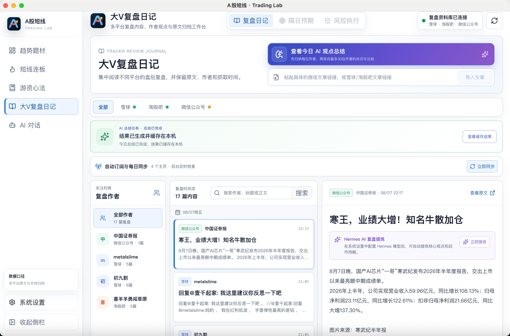

文章收集完成后，可以一键生成「今日大 V 观点共识」，从文章集合中提炼共同关注方向、主要分歧、盘面事实与下一交易日需要验证的条件。

  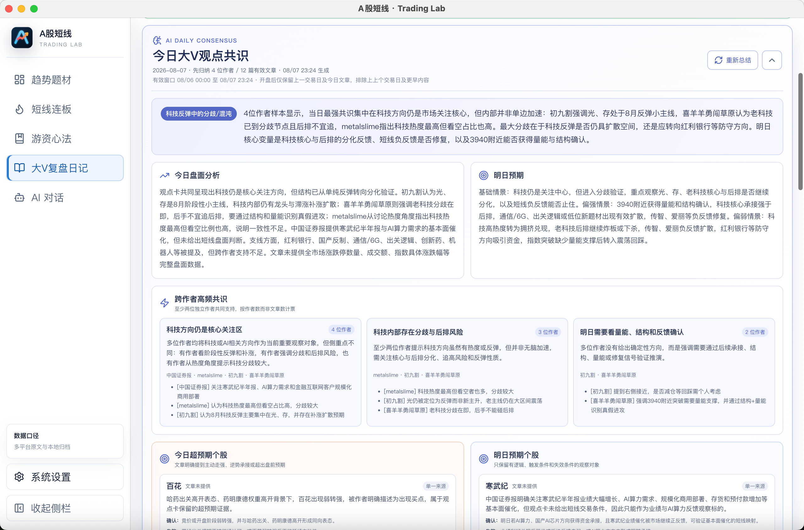

这套能力希望解决的不是“让 AI 猜明天涨什么”，而是把几十篇非结构化文章转化为一份可阅读、可核验、可在次日继续跟踪的观点地图。

### 02 · 超短连板分析

#### 看清梯队、晋级和情绪周期，寻找真正的超短节点

系统将涨停池、连板梯队、昨日反馈、晋级率和情绪历史放在同一视图中，结合历史快照识别情绪周期；各模块独立加载，已有数据可先行展示。

  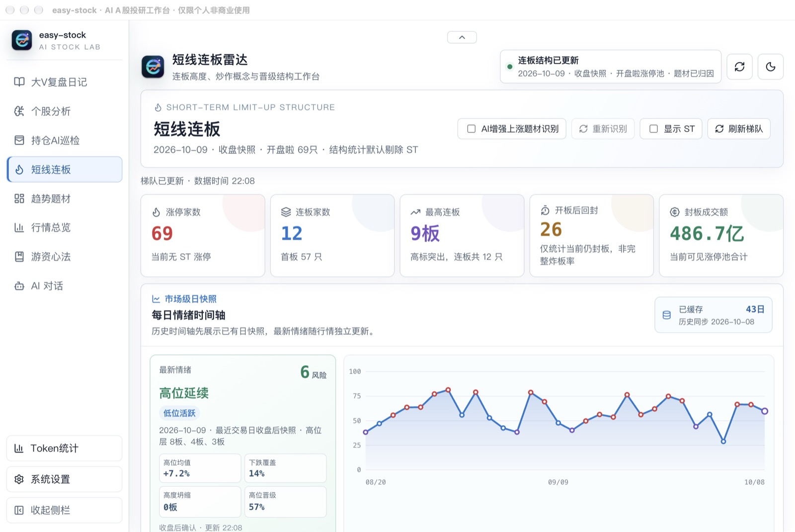

### 03 · 趋势题材雷达

#### 从板块涨跌中识别真正的市场主线：牛市进程分歧研究，熊市进程分歧防守
聚合题材排名、涨跌强度、资金流、上涨宽度和持续天数，通过题材地图拆解产业链、概念节点和细分方向。结合 AI 分析市场趋势、题材阶段和趋势股的条件化介入点。

新增题材指数日 K、周 K 与月 K，结合成交量观察板块整体走势；页面区分数据源指数与等权参考指数，避免将参考曲线误当成官方指数。

  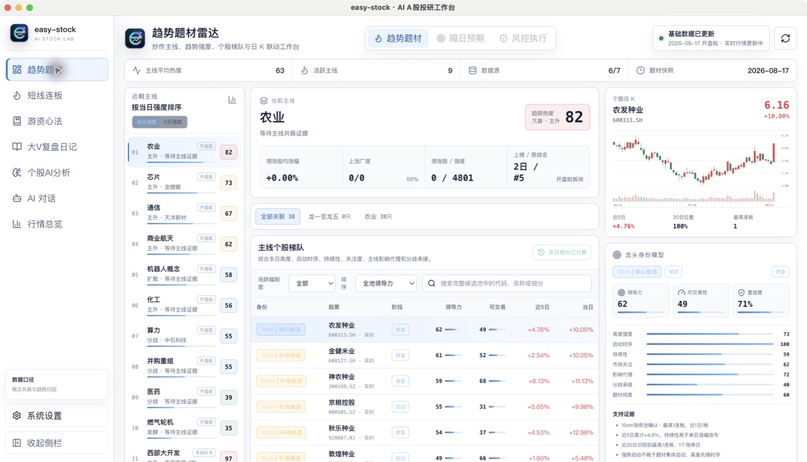

查看题材指数 K 线示例

### 04 · 行情总览

#### 把指数、资金、榜单和研究信号组织成一张可追溯的市场地图

行情总览将市场核心指数、新闻快讯、行业趋势强度、行业资金、题材概念、个股资金流入流出、龙虎榜、公告雷达、机构观点与产业透视统一到同一个研究入口。每个页面保留数据来源与抓取时间，并可将当前上下文直接交给 AI 解读，减少在多个行情终端和资讯页面之间来回切换。

  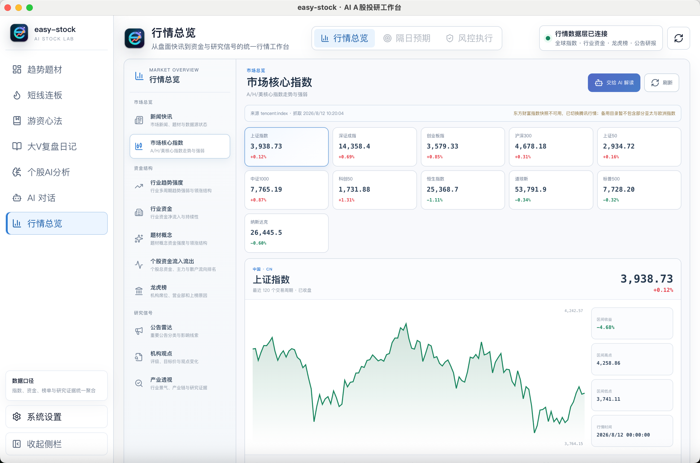

  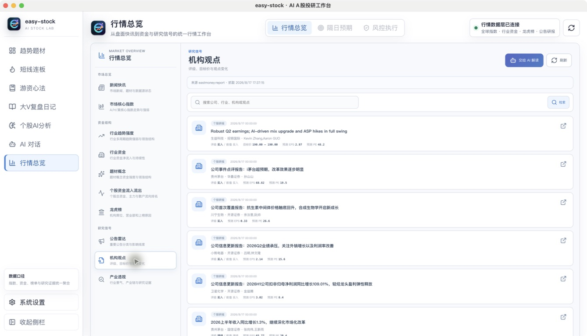

### 05 · 个股分级研究

#### 先确定研究目的，再选择需要多深的分析

支持「观察」「准备新开仓」「已有持仓」三种用途，以及超短、波段和中期三个周期。已有持仓可选填成本，用于理解当前仓位的执行边界。

| 研究方式 | 适合的场景 |
| --- | --- |
| **量化速览** | 先看行情、趋势和量化基线，无需调用 AI 模型 |
| **AI 快速研判** | 快速整理当前主要逻辑与需要核实的问题 |
| **AI 标准研判** | 比较主营、催化、支持与反对证据，形成条件化判断 |
| **AI 深度研究** | 围绕核心分歧进一步补证，展开情景与后续核验 |

研究报告把来源陈述、第三方观点与研究推断分开，展示主营逻辑、核心分歧、反证、确认与失效条件，并保留引用和证据时点。研究阶段会保存已完成内容，可在满足恢复条件时继续缺失阶段。

  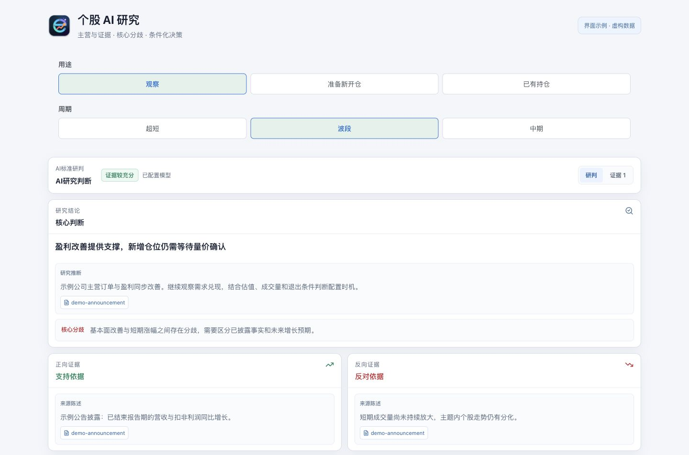

### 06 · 持仓 AI 巡检

#### 将逐股研究放回组合，检查逻辑、结构、风险和策略

选择激进、均衡或稳重风格，设置持有周期，添加最多 10 只股票并配置仓位；成本选填，剩余仓位视为现金。巡检优先复用 **24 小时内有效的个股 AI 报告**，补齐缺失研究后生成组合结论，支持单独刷新某只股票的研究。

查看持仓配置：风格、周期、研究深度与仓位

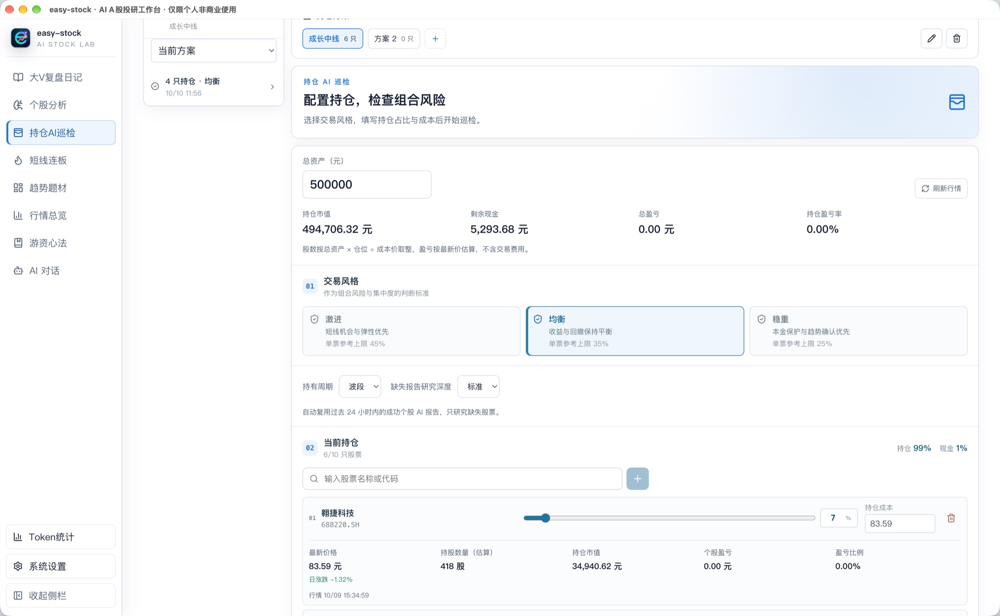

组合综合评分由 AI 按四个维度给出依据，程序按固定权重复算和校验：**持仓逻辑质量 35%、组合结构合理性 25%、风险管理质量 25%、策略匹配度 15%**。评分只评价股票组合，满仓、现金比例和总仓位本身不加扣分；集中度按股票内部配比衡量。

  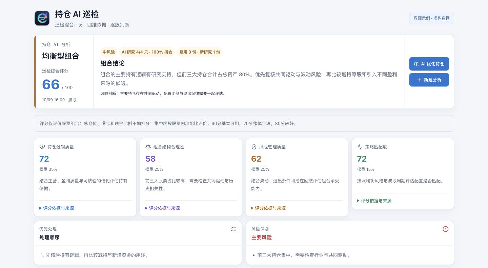

报告同时保留逐股判断、共同驱动与历史相关性、研究来源、确认和失效条件。完成的个股报告可直接打开；任务在后台运行，报告和恢复记录保存在本机。

### 07 · AI 持仓优化

#### 比较原组合与建议组合，解释资金为什么从这里调到那里

在巡检报告中点击「AI 优化持仓」，依次完成候选筛选、个股研究、投资比较、程序配仓和独立复评。既比较增持已有股票，也研究引入新股票的必要性，输出目标比例、资金来源及入场和退出条件。

- **保留资金边界**：股票总仓位与现金不变；累计替换不超过优化链初始股票仓位的 70%，最多新增 2 只，目标持仓最多 10 只。
- **同次比较**：原持仓与建议持仓使用统一资料和行情独立复评，评分改善按这次复评计算。原巡检分单独保留，两次 AI 评估可能存在差异。
- **检查实际改善**：综合投资价值、组合结构、交易资格和风险约束，评分提高本身不足以通过采纳检查。结果可能是条件性方案、合格备选，或本次暂不调整。
- **保存中间结果**：股票判断、投资比较和复评部分分别保存；失败后可恢复尚未完成的部分，重新开始时仍可复用有效研究。

  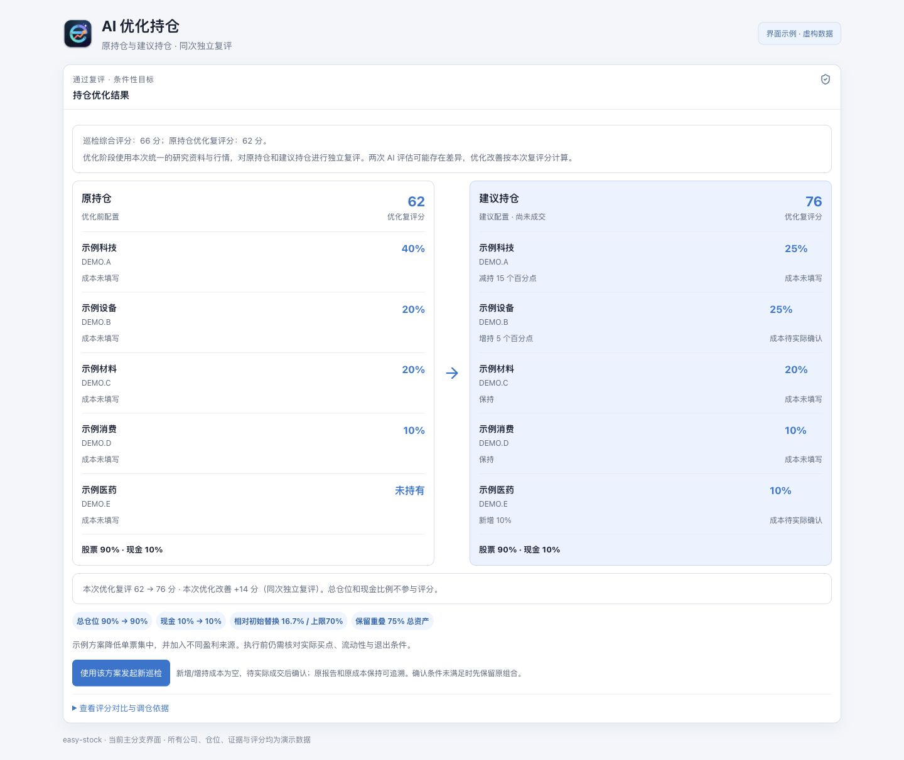

「使用该方案发起新巡检」会把目标组合带入新的分析，**不会自动下单或修改实际持仓**。评分代表当前证据下的研究评价，不代表收益率或胜率。

### 08 · 游资心法与 AI Copilot

#### 把经验材料变成可持续研读的知识，让 AI 越用越懂你的研究方式

  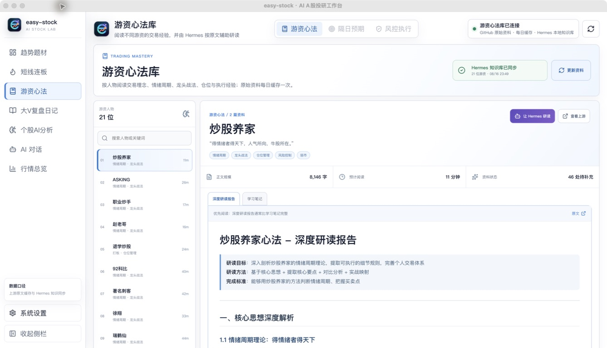

### 每日研究闭环

| 阶段 | easy-stock 提供的能力 |
| --- | --- |
| **盘中发现** | 行情总览、趋势题材、实时行情、题材地图、涨停梯队和数据源状态 |
| **个股研判** | 量化速览与分级 AI 研究、主营与催化、支持与反对证据、条件与情景 |
| **持仓巡检** | 有效报告复用、四维综合评分、集中与联动风险、逐股判断和来源核验 |
| **持仓优化** | 候选筛选、投资比较、程序配仓、原 / 目标同次复评与条件性方案 |
| **收盘复盘** | 情绪时间轴、昨日反馈、晋级结构和连板梯队分析 |
| **信息收集** | 大 V 主页自动同步、文章导入、正文清洗和本地归档 |
| **AI 提炼** | 单篇摘要、作者归纳、跨作者共识、分歧和明日观察条件 |
| **长期积累** | 文章资料库、游资心法、个股分析记录、AI 会话和本地研究记忆 |

---

## AI 如何赋能 A 股研究

### 1. 从“看数据”升级为“理解市场结构”

easy-stock 先通过领域化数据模型整理题材、梯队、涨停原因、趋势、相对强度和情绪历史，再把这些结构交给 AI 解释。AI 面对的不再是一组孤立数字，而是一套带有 A 股语义的市场证据。

### 2. 从“手工翻网页”升级为“Agent 主动执行”

桌面 Browser Bridge 优先复用 Electron 持久浏览器会话，按照订阅配置访问雪球或淘股吧主页、发现并读取文章；缺少桌面桥接时，可由所选 Agent 配合 agent-browser 采集。Go 复盘服务完成元数据整理、去重、归档与 AI 提炼。

### 3. 从“单篇摘要”升级为“观点网络”

系统先归纳每位作者的核心观点，再汇总当日多位作者的共识与分歧，区分盘面事实、少数预期、共同关注方向和下一交易日需要验证的条件。

### 4. 从“通用问答”升级为“A 股研究 Copilot”

AI 会话经过本机统一 Agent 服务，可选择 Hermes 或 Codex 运行时。两者共享模型连接、思考强度、Skills 与 MCP 设置，分别管理原生会话；业务任务绑定运行时和模型配置，支持模型调用、会话续接、工具协作与任务上下文。

目前可以配置 OpenAI、DeepSeek、通义千问、Moonshot、Anthropic，以及兼容接口的自定义服务；Codex 需要支持 Responses 的模型连接。

### 5. 从“用完即走”升级为“长期研究飞轮”

| 感知 | 理解 | 行动 | 记忆 | 验证 |
| --- | --- | --- | --- | --- |
| 获取实时行情、题材和文章 | AI 识别结构、观点和分歧 | 自动同步、分析并生成预案 | 本地保存文章、历史和会话 | 下一交易日用行情与原文验证 |

每一次验证都会成为下一次研究的上下文。随着使用时间增加，软件积累的不只是更多数据，而是一套更贴近使用者的研究流程和认知资产。

---

## AI 原生架构

Go 后端负责行情采集、量化计算、证据组织与任务编排，统一 Agent 服务按配置选择 Hermes 或 Codex。数据服务与 AI 推理并行协作，量化速览无需调用模型；个股深度研究在证据快照上完成问题提纲、只读补证、核心判断、交易条件与引用校验。

  <a href="./docs/assets/easy-stock-ai-architecture.svg">
    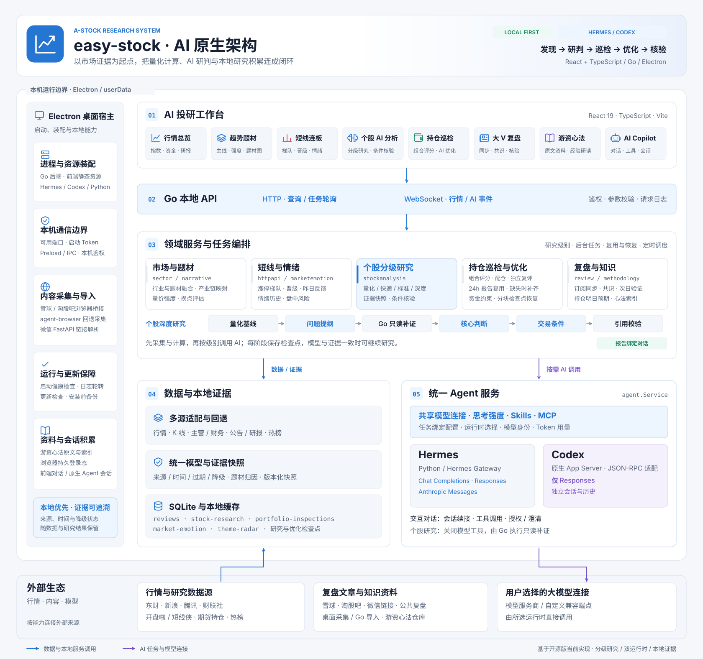
  </a>

| 层级 | 核心职责 |
| --- | --- |
| **AI 投研工作台** | React + TypeScript：行情总览、趋势题材、短线连板、个股分级研究、持仓巡检与优化、大 V 复盘、游资心法与 AI Copilot |
| **Go 本地 API** | HTTP 查询与后台任务轮询；WebSocket 行情与 AI 事件；本机鉴权、参数校验与请求日志 |
| **领域服务与任务编排** | 题材融合、梯队与情绪计算、拐点评估、个股研究、持仓报告复用与组合评分、候选筛选与优化复评、观点共识、次日验证与定时同步 |
| **数据与本地证据** | 多源适配与回退、统一行情模型、题材归因、带来源和时间的版本化快照；SQLite 保存复盘、研究任务、持仓巡检与优化检查点、情绪历史与题材缓存 |
| **统一 Agent 服务** | 共享模型连接、思考强度、Skills 与 MCP；选择 Hermes 或 Codex；任务绑定配置、会话续接、授权与澄清、Token 用量统计。Codex 使用原生 App Server，仅支持 Responses 连接 |
| **Electron 桌面宿主** | 装配 Go / Hermes / Codex / Python；分配本机端口与启动 Token；Preload / IPC；雪球与淘股吧 Browser Bridge、agent-browser 回退、微信链接解析；日志、更新与安装前备份 |
| **外部生态** | 行情与研究数据源、内容平台、公共复盘与心法资料，以及由所选运行时直接调用的模型服务商或兼容端点 |

个股研究按阶段保存检查点，支持在模型配置与证据一致时继续执行；持仓巡检优先复用 24 小时内成功的个股报告，补齐缺失研究后生成组合报告。持仓优化保存股票判断、投资比较和复评检查点，恢复时继续缺失部分。模块与代码入口见 [当前架构说明](./backend/docs/architecture.md)。

---

## 快速开始

### 1. 用户

无需安装 Node.js、Go 或 Python。前往 [GitHub Releases](https://github.com/jundizhou/easy-stock/releases/latest) 下载适合当前系统的桌面安装包或压缩包。

首次使用请阅读 [使用帮助：配置大模型与雪球、淘股吧登录](./docs/user-guide.md)，其中包含 DeepSeek、Kimi 从购买 API 额度、创建 API Key 到连接测试的完整步骤。

添加或启用本机 Skill，请阅读 [Skill 添加与启用说明](./docs/skill-installation.md)。

### 2. 开发者

需要从源码运行、调试、测试或打包，请阅读 [开发者文档](./docs/development.md)。

飞书与钉钉群机器人通知可在「系统设置 → 消息通知」中配置，支持签名、关键词和测试发送。接入步骤及通知范围见 [消息通知配置](./docs/notifications.md)。

## 社区与贡献

- 使用交流、研究方法和案例分享，请前往 [GitHub Discussions](https://github.com/jundizhou/easy-stock/discussions)。
- 遇到错误或数据异常，请使用 [Bug 报告](https://github.com/jundizhou/easy-stock/issues/new/choose)，并尽量附上系统版本、应用版本和复现步骤。
- 有产品建议或数据源需求，请提交 [功能建议](https://github.com/jundizhou/easy-stock/issues/new/choose)，说明使用场景和期望结果。
- 希望参与代码或文档建设，请先阅读 [贡献指南](./CONTRIBUTING.md) 和 [产品路线图](./ROADMAP.md)。
- 涉及安全问题时，请按照 [安全策略](./SECURITY.md) 私下报告，不要公开敏感细节。

---

## 许可与商业使用

easy-stock 项目原创的后端、前端、桌面端和文档采用 [PolyForm Noncommercial License 1.0.0](./LICENSE) 授权。

- 允许个人出于学习、研究、实验和其他非商业目的使用、修改及分发，但必须保留许可证与版权声明。
- 未经作者明确书面许可，不得用于任何直接或间接的商业用途，包括但不限于企业生产环境、收费服务、SaaS、付费咨询或培训、商业产品集成、二次销售以及以本项目获利。
- 如需商业使用，请通过 [GitHub 仓库](https://github.com/jundizhou/easy-stock) 联系作者 jundizhou，取得单独的商业授权。
- 第三方依赖、数据源和随包材料不受本项目许可证重新授权，仍分别遵循其原始许可证及服务条款。
- 欢迎在许可范围内提交 Issue、文档改进和代码贡献；贡献代码在被合并后按本项目相同许可证发布。

> 本项目属于源码可用（source-available）软件，并非 OSI 定义下允许商业使用的开源软件。

---

## 风险提示

> 本项目仅用于学习、研究和信息整理，不构成任何投资建议、收益承诺或交易依据。市场有风险，AI 输出和第三方数据也可能存在延迟、遗漏或错误，请始终结合原始信息独立判断并自行承担决策结果。

---

## Star 历史

  <picture>
    <source media="(prefers-color-scheme: dark)" srcset="https://api.star-history.com/svg?repos=jundizhou/easy-stock&type=Date&theme=dark" />
    <source media="(prefers-color-scheme: light)" srcset="https://api.star-history.com/svg?repos=jundizhou/easy-stock&type=Date" />
    
  </picture>

Local first · Evidence based · Human in control

