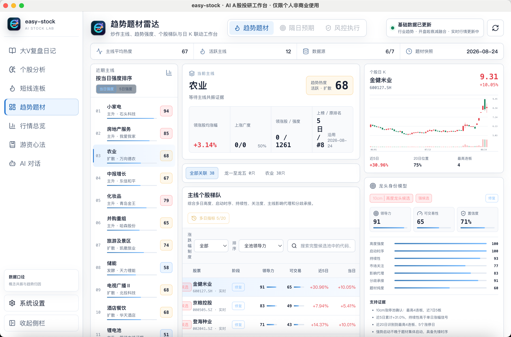

<!--
发布标题：easy-stock：让 AI 真正进入 A 股研究全流程
封面短句：不只是行情，不只是问答，而是一套持续进化的研究系统
摘要：easy-stock 将行情、题材、连板、个股、持仓与复盘连接起来，让 AI 能够感知市场、理解结构、执行任务、形成记忆，并让每一项判断回到证据。
配图：easy-stock-product-overview.png
-->

# easy-stock：让 AI 真正进入 A 股研究全流程

AI 时代的股票软件，不应该只是在传统行情终端旁边多放一个聊天框。

行情软件已经能够提供足够多的价格、涨跌幅和成交额，真正稀缺的是把分散信息组织成判断的能力：市场主线是否形成，题材处于启动还是退潮，连板高度能否获得正反馈，个股强度来自趋势还是情绪，当前持仓是否暴露在同一种风险之下。

easy-stock 由此出发，将行情分析、题材研究、个股研判、组合巡检、盘后复盘和 AI 协作放进同一个桌面工作台。它不试图替代人的决策，而是让研究过程更完整，让判断依据能够被保存，让每一个结论都可以在下一交易日继续验证。

*图：easy-stock A 股 AI 智能投研工作台。截图中的行情、股票和评分仅用于展示界面。*

## 从“展示数据”走向“理解市场”

easy-stock 不是多个行情页面的简单集合，而是围绕 A 股研究构建了一套连续的信息处理方式：

- **感知市场**：聚合开盘啦、东方财富、新浪、腾讯和财联社等来源，统一行情、K 线、题材、涨停、资金与资讯数据。
- **理解结构**：将题材持续性、连板梯队、市场情绪、量价和相对强度整理成可计算的领域模型。
- **执行任务**：通过调度任务、内置浏览器与 Agent 完成文章发现、去重、归档和观点提炼。
- **形成记忆**：将文章、分析记录、巡检报告、情绪历史和 AI 会话保存在当前设备。
- **验证结论**：保留数据来源、更新时间、评分维度、风险条件与降级状态，使判断能够返回证据层核验。

这五个环节共同构成 easy-stock 的核心：AI 不再面对一组缺少背景的孤立数字，而是进入一套带有 A 股语义、研究上下文和历史记忆的工作流。

## 一套贯穿交易日的研究工作台

盘前，「行情总览」统一呈现核心指数、行业趋势、资金、公告、龙虎榜和机构观点，用于建立当日市场背景。

盘中，「趋势题材雷达」和「短线连板分析」分别观察主线强度、个股梯队、涨停结构、晋级率和情绪反馈，帮助区分趋势行情、题材扩散和短线接力环境。

进入个股研究后，「个股 AI 分析」会识别股票更接近情绪连板、趋势容量、趋势成长、震荡观察还是弱势风险路径，再结合多周期趋势、相对强度、题材归因和市场环境，形成带有确认与失效条件的报告。

对于多只持仓，「持仓 AI 巡检」继续从单票走向组合，识别题材集中、个股联动、风格错配与风险贡献。仓位表中的多只股票，由此被还原为一套真实的风险结构。

收盘后，「大 V 复盘日记」自动整理雪球、淘股吧和微信公众号等来源的文章。系统在保留原文的基础上，提取作者观点、跨作者共识、主要分歧和下一交易日验证条件，让你告别带有主观的一篇篇阅读大v复盘，自动客观完成复盘总结。

## Hermes：连接模型、工具与本地研究记忆

easy-stock 的 AI 能力统一运行在本机 Hermes Runtime 中。Hermes 负责模型调用、会话续接、工具路由、知识技能和任务上下文，业务功能不直接绑定某一家模型厂商。

系统支持 OpenAI、DeepSeek、通义千问、Moonshot、Anthropic，以及兼容 OpenAI 协议的自定义服务。模型可以更换，研究资料、分析历史和工作流程仍然保留在本地。

这种设计让 AI 不只用于生成一段回答，还可以围绕同一研究目标持续对话、调用工具、研读资料和拆解验证条件，并且越用越聪明，他会不断提取你的交易经验，形成专属于你的交易ai工具。

## 获取 easy-stock

普通用户可直接从 GitHub Releases 下载桌面版本，无需安装 Node.js、Go 或 Python。项目原创代码和文档采用 PolyForm Noncommercial License 1.0.0，可用于个人学习、研究和其他非商业用途。

项目地址：<https://github.com/jundizhou/easy-stock>

最新版本：<https://github.com/jundizhou/easy-stock/releases/latest>

QQ 交流群：422158208 也可以加群在群文件下载

后续文章将分别介绍大 V 复盘、观点共识、短线情绪、趋势题材、行情总览、个股分析、持仓巡检、游资心法和 Hermes AI 对话等具体功能。

> 风险提示：easy-stock 仅用于学习、研究和信息整理，不构成任何投资建议、收益承诺或交易依据。AI 输出和第三方数据可能存在延迟、遗漏或错误，请以原始信息为准并独立判断。
