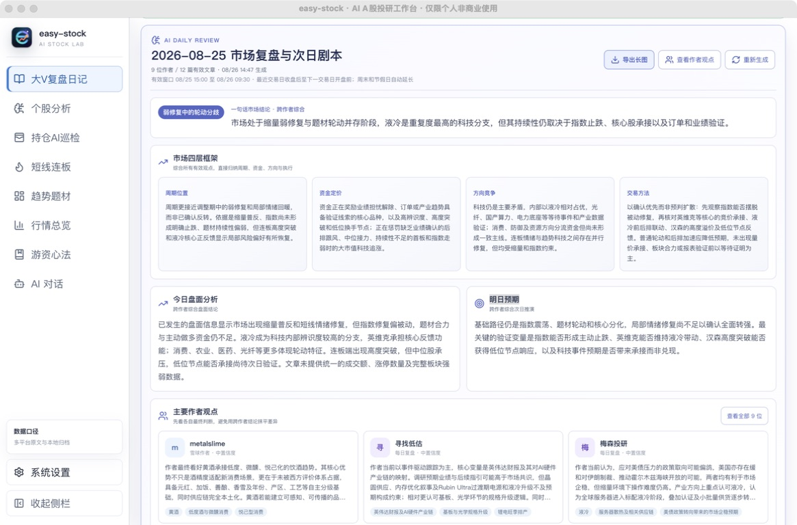
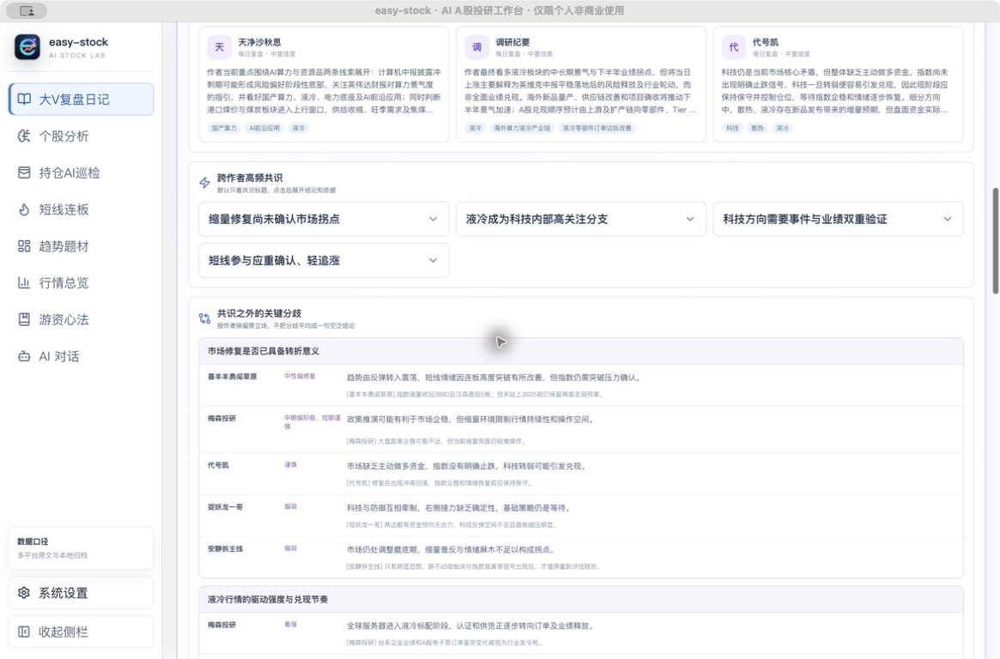
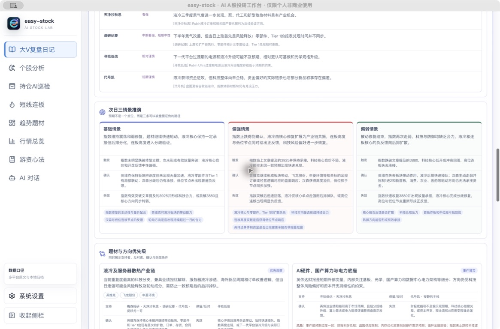

<!--
发布标题：easy-stock：大 V 自动 AI 复盘，把全网盘后观点变成一张次日作战地图
封面短句：9 位作者、12 篇文章，一次完成共识提炼与次日推演
摘要：easy-stock 自动归档多平台盘后文章，通过“单作者提炼 + 跨作者综合”识别共识与分歧，并生成市场框架、三情景推演、观察剧本和验证清单。它不是另一款摘要工具，而是一套能回到原文、能被次日盘面检验的 AI 复盘系统。
配图：easy-stock-review-summary-2026-08-25.jpg
-->

# easy-stock：大 V 自动 AI 复盘，把全网盘后观点变成一张次日作战地图

盘后最不缺的是观点。

真正稀缺的，是在有限时间内判断：哪些是跨作者反复出现的有效信号，哪些只是同一叙事的重复传播；哪些结论已经得到盘面确认，哪些仍停留在预期；明天开盘以后，究竟应该观察什么。

传统复盘往往从逐个平台刷主页开始，随后是复制文章、整理出处、提取重点、比较观点。作者越多，信息量越大，最后越容易得到一份看似丰富、却无法直接执行和验证的观点合集。

easy-stock 的「大 V 复盘日记」试图结束这种低效循环。

它把雪球、淘股吧和微信公众号等来源的盘后内容集中到本地，在原文归档的基础上完成作者级提炼与跨作者综合，最终输出共识、分歧、市场结构、次日情景和验证清单。整个过程不是把文章简单压缩，而是把分散观点重建为一套可以回查、可以证伪、可以持续复用的研究系统。

*图：真实生成的 2026-08-25 市场复盘，覆盖 9 位作者与 12 篇有效文章。*

## 让“人肉刷主页”退出日常复盘

easy-stock 支持订阅雪球、淘股吧作者主页，按计划同步新文章并自动去重；微信公众号文章可通过已知链接导入。正文、作者、平台、发布时间与原文地址统一进入本地资料库，后续无需在多个应用之间反复切换。

这里解决的不只是“收藏文章”。

系统会保留完整原文和来源关系。任何 AI 结论都能继续下钻到作者观点，再回到原始文章核验。资料不会随着平台信息流下沉而消失，同一作者在不同市场阶段的判断也能够形成连续时间线。

从此，复盘的起点不再是寻找资料，而是直接进入判断。

## 不是把 12 篇文章拼成一段摘要

普通摘要工具擅长缩短文本，却很难解决多作者研究中最关键的三个问题：重复、分歧与证据权重。

easy-stock 采用两阶段 AI 分析。

第一阶段，系统逐篇阅读文章，提炼每位作者的最终判断、核心方向、逻辑依据、风险与可验证条件；第二阶段，再将作者观点放到同一张研究桌上进行跨作者综合。

其中有一条非常重要的规则：**每位作者只计一票。**

同一作者一天发布多篇文章，不会因为文章数量更多而被放大权重；同一产业叙事被多人转述，也不会自动等于事实已经得到验证。系统尽可能区分独立共识、信息同源和单一来源观点，避免让“声音大”冒充“确定性高”。

这使输出从内容摘要跃迁为观点分析。

## 9 位作者、12 篇文章，AI 给出的不是万能结论

以 2026 年 8 月 25 日生成的真实复盘为例，系统在有效时间窗口内纳入 9 位作者、12 篇文章，最终将市场概括为：

> 弱修复中的轮动分歧。

综合结论认为，市场处于缩量弱修复与题材轮动并存阶段。液冷是重复度最高的科技分支，但持续性仍取决于指数止跌、核心股承接，以及订单和业绩验证。

一句话结论之后，系统继续把市场拆成四层：

- **周期位置**：判断当前更接近调整、修复还是反转，而不是被单日涨跌带偏。
- **资金定价**：识别资金正在奖励什么、惩罚什么。
- **方向竞争**：比较科技、消费、防御、资源及连板情绪之间的资金关系。
- **交易方法**：把宏观判断收束为第二天可观察的确认条件。

这四层框架的价值，在于强迫复盘从“今天涨了什么”继续走向“为什么涨、谁在定价、明天如何证明”。

## 真正有价值的系统，必须保留分歧

多数内容产品会把不同观点揉成一句四平八稳的结论。这样读起来没有冲突，也往往没有决策价值。

easy-stock 不会强行抹平分歧。

在这份复盘中，多位作者都关注液冷，但对行情强度和兑现节奏的判断并不一致：有人认为行业已经进入订单与业绩释放阶段；有人认可中期景气，却认为当日上涨首先是风险释放；也有人提示下一代平台过渡期的升级幅度可能低于预期。

系统会保留每一方的原始立场、论据和风险提示，并明确哪些结论来自多人共识，哪些只有单一来源。

*图：共识按作者计票，分歧保留各方立场，不把不同判断平均成一句空话。*

共识告诉市场正在交易什么；分歧决定下一步最大的预期差可能出现在哪里。两者缺一不可。

## 从“预测明天”升级为三条可证伪路径

市场从来不会只沿一条路线运行。

因此，easy-stock 不给出一个看似精确的单点预测，而是生成基础、偏强、偏弱三种情景。每种情景都包含触发条件、确认信号、失效条件和重点观察项。

在这次案例中：

- 基础情景关注指数震荡、题材轮动、液冷核心承接和后排分化。
- 偏强情景要求指数止跌得到确认，液冷由核心修复扩展为产业链共振，连板高度与低位节点同时给出正反馈。
- 偏弱情景关注被动修复结束后，指数、科技核心与高位连板的负反馈是否向后排扩散。

*图：基础、偏强、偏弱三条路径均给出触发、确认和失效条件。*

这不是为了让 AI “猜中涨跌”，而是提前建立应对框架：盘面出现什么信号，原判断才成立；出现什么变化，就应该承认判断失效。

## 一张从竞价写到收盘的观察剧本

情景推演之后，系统还会继续生成明日观察剧本，将下一交易日拆成四个阶段：

**竞价 / 盘前**，核对核心标的是否获得与前一日表现相匹配的溢价；

**开盘前 30 分钟**，观察指数主动性、核心带动与高低位联动；

**盘中确认**，区分有层次的板块共振与单点脉冲；

**收盘验证**，重新检查主线强弱、核心与后排关系，以及事件预期是否被提前透支。

最终形成的明日验证清单，会把最重要的条件逐条列出。用户不需要记住一篇数千字复盘，只需要在盘中核对这些关键变量。

复盘由此不再是一篇读完即止的文章，而成为下一交易日可以直接调用的研究底稿。

## 昨日观点，交给今日盘面核验

AI 复盘最容易被忽略的一步，是验证。

easy-stock 提供「昨日验证」视图。下一交易日结束后，可以根据实际盘面把昨日判断标记为正确、部分正确、错误或无法验证，并记录对应证据。

这一步让系统具备真正的闭环：昨天提出假设，今天检查条件，随后修正对作者、题材和市场阶段的认识。

没有验证的复盘，只是在积累观点；能够持续验证的复盘，才是在积累认知。

## 这不是另一款摘要工具

大 V 自动 AI 复盘真正压缩的，不只是阅读时间，而是盘后研究中最昂贵的重复劳动：找文章、辨重复、记出处、比观点、拆条件、做验证。

它同时完成五件事：

- 自动收集多平台内容，并在本地长期归档；
- 以作者为单位提炼观点，防止文章数量制造虚假共识；
- 同时呈现共识与分歧，保留判断所依赖的证据；
- 将次日预期拆为三种可证伪情景与盘中观察剧本；
- 用下一交易日的真实盘面核验昨日观点，形成持续迭代的研究闭环。

当这套流程每天自动运行，逐个平台刷主页、复制粘贴和人工去重可以真正退出日常复盘。留下来的，是更高密度的判断、更清晰的风险边界，以及一套不断积累的个人研究数据库。

项目地址：<https://github.com/jundizhou/easy-stock>

最新版本：<https://github.com/jundizhou/easy-stock/releases/latest>

微信公众号：**easy只吃番茄**

QQ 交流群：**422158208**

> 风险提示：easy-stock 仅用于学习、研究和信息整理，不构成任何投资建议、收益承诺或交易依据。AI 输出与第三方数据可能存在延迟、遗漏或错误，请结合原始信息独立判断并自行承担决策结果。
