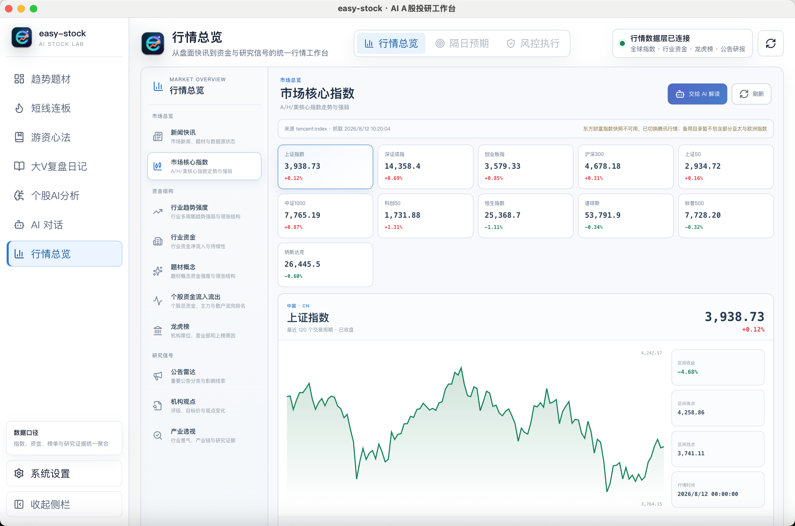
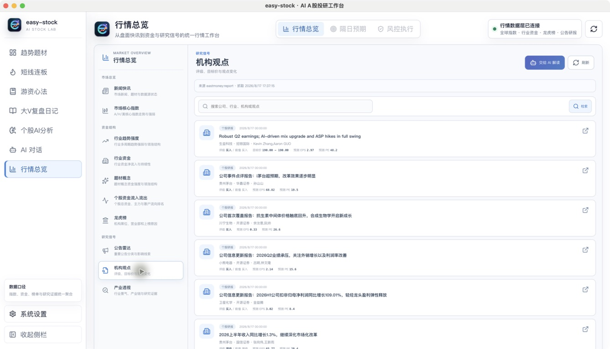

<!--
发布标题：行情总览：快速建立市场全景
封面短句：统一查看指数、资金、公告与研究信号
摘要：行情总览将核心指数、行业趋势、资金、龙虎榜、公告和机构观点组织为统一入口，并保留来源和更新时间。
配图：easy-stock-market-overview-indices.png、easy-stock-market-overview-research.png
-->

# 行情总览：快速建立市场全景

盘前和盘中需要处理的信息包括指数、行业表现、资金流向、新闻快讯、公司公告和机构研究。信息分散时，容易出现数据口径混用、更新时间不一致和关键来源遗漏等问题。

easy-stock 的「行情总览」将市场数据与研究信号组织在同一个入口，用于快速建立市场背景，并支持将当前页面上下文交给 AI 解读。

*图：市场核心指数视图统一展示 A/H 股及主要跨市场指数，并保留来源和更新时间。*

## 市场核心指数

核心指数视图汇总 A 股、港股和主要跨市场指数，用于比较不同市场和不同风格之间的相对表现。

页面保留数据来源与抓取时间。当不同数据源存在交易日或更新口径差异时，系统会显示相应提示，避免将历史完整数据与实时数据混合解读。

## 行业趋势与资金结构

行业趋势强度用于观察板块的连续表现，行业资金用于补充价格变化背后的资金结构。结合行业涨幅、趋势强度和资金数据，可以进一步区分短期价格波动与持续性方向。

题材概念、个股资金流入流出和龙虎榜等页面提供更细的结构信息。相关数据主要用于解释已经发生的行情，仍需结合个股位置和市场环境使用。

## 新闻、公告与研究信息

新闻快讯、公告雷达和产业透视集中展示盘面消息与公司信息。涉及业绩、监管、停复牌和重大合同等内容时，可以通过原始来源核对完整公告。

*图：机构观点支持按公司、行业和关键词检索，并保留原始报告入口。*

机构观点页面支持按股票、行业和关键词检索研究资料。报告标题、发布时间、评级和盈利预测等信息会一并展示，便于判断资料时效并返回原文。

AI 可以辅助解释术语、比较不同机构观点和整理当前页面信息。关键数字、估值假设和公司事实仍应以原始报告和公告为准。

## 典型使用流程

行情总览可以按照以下顺序使用：

1. 通过核心指数确认市场背景和风格差异。
2. 结合行业趋势与资金数据筛选需要继续研究的方向。
3. 查看与自选、持仓和既定研究计划相关的公告与快讯。
4. 使用机构观点和产业透视补充长期研究证据。

该流程的重点是建立信息层级，而不是在单一页面得出交易结论。

下一篇将介绍「个股 AI 分析」，展示系统如何组织多周期趋势、题材归因、条件决策和事实证据。

> 风险提示：市场数据、新闻、公告和研报可能存在延迟、遗漏或口径差异。本文仅介绍产品功能，不构成投资建议。
