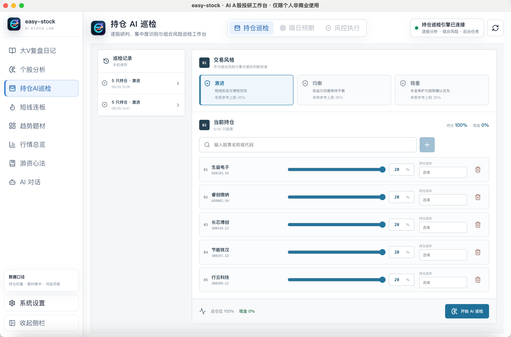
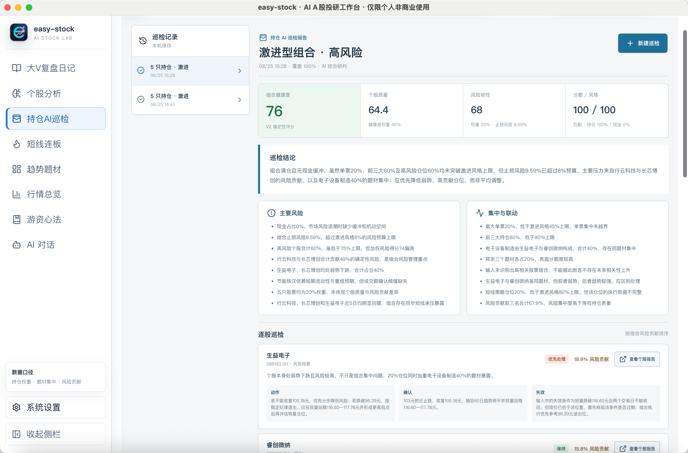

<!--
发布标题：持仓 AI 巡检：识别组合集中度与联动风险
封面短句：仓位分散不等于风险分散
摘要：持仓 AI 巡检在逐股分析的基础上，进一步识别题材集中、个股联动、风格匹配和风险贡献。
配图：easy-stock-portfolio-inspection-setup.png、easy-stock-portfolio-inspection-report.png
-->

# 持仓 AI 巡检：识别组合集中度与联动风险

多只股票权重相同，并不代表组合风险已经分散。如果持仓集中在相近题材、走势高度相关，或者高波动股票承担了较大仓位，组合仍可能暴露在单一风险来源中。

easy-stock 的「持仓 AI 巡检」在完整个股分析的基础上，进一步评估组合健康度、集中度、联动关系和交易风格匹配。

*图：示例组合选择激进风格，添加 5 只股票并分别配置 20% 仓位。股票仅用于功能演示。*

## 交易风格与持仓输入

新建巡检时，可以选择激进、均衡或稳重的交易风格。不同风格对应不同的单票仓位和风险判断标准。

系统支持通过股票名称或代码添加最多 10 只持仓，并配置仓位占比和可选的持仓成本。总仓位不能超过 100%，剩余部分自动视为现金。

仓位数据直接影响组合风险贡献。缺少真实权重时，系统可以完成个股分析，但无法准确评估集中和联动风险。

## 后台逐股分析

开始巡检后，系统会在后台逐只调用完整个股分析能力，再结合交易风格、仓位结构和个股风险生成组合报告。

任务运行期间可以继续使用其他功能。完成后的报告保存在本机巡检记录中，已生成完整分析的股票可以直接跳转查看对应个股报告。

## 组合健康度与风险贡献

组合报告采用确定性健康度评分，拆分展示个股质量、风险韧性、分散程度和风格匹配。

*图：示例组合虽然五只股票等权，但报告仍识别出满仓、题材集中和个股同步风险。*

报告还会识别题材集中、个股联动、止损风险和风险贡献。等权组合中，波动更高、结构更弱或与其他持仓相关性更高的股票，可能承担更高的风险贡献。

逐股巡检会给出动作、确认条件和失效条件。组合层面的共同问题应与单只股票问题区分处理，避免只更换个股名称而没有改变实际风险暴露。

## 使用边界

健康度用于比较同一组合在不同时间的结构变化，不代表预期收益，也不适合与其他账户直接比较。

巡检只基于录入的持仓和交易风格，无法覆盖完整资产状况、现金需求和个人风险承受能力。最终仓位决策不能由自动报告替代。

下一篇将介绍「游资心法库」，说明原始交易资料如何进入本地知识库，并由 Hermes 辅助研读。

> 风险提示：持仓巡检仅用于组合研究和风险提示，不构成调仓建议。请结合完整资产状况和个人风险承受能力独立决策。
