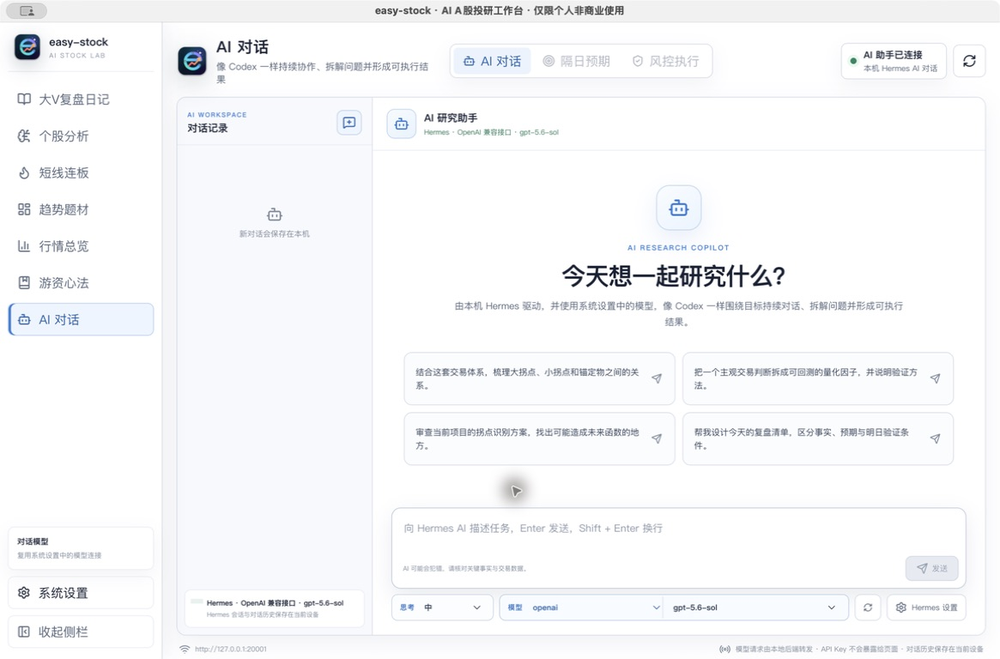

<!--
发布标题：Hermes AI 对话：把研究判断拆解为可验证条件
封面短句：围绕事实、预期与风险持续研究
摘要：Hermes AI 对话复用系统模型配置和本地会话，适合整理研究资料、检查逻辑矛盾，并生成可验证的盘前与复盘清单。
配图：easy-stock-ai-copilot.jpg
-->

# Hermes AI 对话：把研究判断拆解为可验证条件

市场研究中的主观判断通常同时包含事实、解释和预期。如果三者没有明确区分，AI 容易生成内容完整但缺少验证边界的回答。

easy-stock 的「Hermes AI 对话」用于持续整理研究任务、拆解逻辑和生成检查清单。它不以预测涨跌为目标，而是帮助明确结论依据、确认条件和失效条件。

*图：Hermes AI 对话支持本地会话、模型配置、思考等级和连续追问。截图中的模型仅为当前设备配置示例。*

## 本地 Hermes Runtime

Hermes 使用系统设置中的模型连接，支持 OpenAI、DeepSeek、通义千问、Moonshot、Anthropic，以及兼容 OpenAI 协议的自定义服务。

模型请求由本地后端转发，API Key 不会暴露给页面。对话记录和 Hermes 会话历史保存在当前设备，更换模型不会改变本地研究资料的保存方式。

## 研究判断拆解

Hermes 适合将一条主观判断拆分为四部分：

1. 已经发生且可以核对的事实。
2. 尚未兑现的主观预期。
3. 下一交易日的确认条件。
4. 原判断需要撤回的失效条件。

例如，可以使用以下任务模板：

> 任务：基于已提供的行情和复盘材料，将判断拆分为事实、预期、确认条件和失效条件。每一条标明依据；缺少数据支持的内容标记为“待验证”，不补充不存在的行情。最后生成一份不超过 8 项的盘前检查清单，不给出买卖指令。

连续对话可以继续检查确认偏误、条件重复和不同情景下的逻辑一致性，使研究结论具备明确边界。

## 区分事实、解释与动作

事实包括昨日连板反馈、题材上涨宽度和个股相对强度等可核验数据；解释是对这些数据的理解；动作则属于具体研究或交易计划。

Hermes 可以按层级整理三类内容，并返回相关依据。无法核对的解释不应被视为事实，也不应直接进入执行计划。

## 思考等级与任务耗时

复杂任务可以选择不同思考等级。较高思考强度适合比较多份材料、审查逻辑矛盾或设计验证方法，但不会自动提高数据时效，也无法补齐缺失行情。

长任务可能需要数分钟。运行期间可以继续使用其他功能，完成后仍需检查数据日期、来源和假设。数据源缺失或模型连接异常时，应降低结论确定性。

## 使用边界

Hermes 可以整理材料、暴露矛盾和生成检查表，不替代用户决定仓位、承担损失或执行交易。AI 输出必须与行情数据和原始资料相互核验。

至此，easy-stock 的主要研究流程已经完整展开：通过行情与题材观察市场结构，通过个股和持仓分析检查证据与风险，通过复盘资料和 Hermes 对话沉淀可持续验证的研究记录。

项目地址：<https://github.com/jundizhou/easy-stock>

QQ 交流群：422158208

> 风险提示：AI 可能犯错，第三方数据可能延迟或遗漏。本文仅介绍研究方法和软件功能，不构成投资建议、收益承诺或交易依据。
