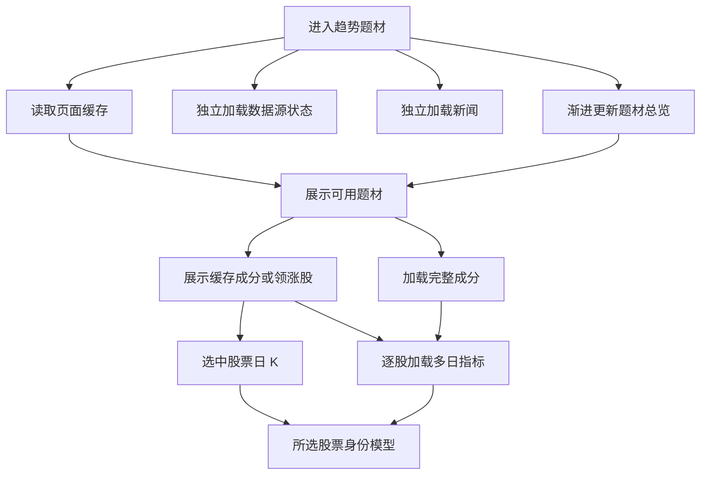

# 趋势题材分批加载与渐进渲染方案

日期：2026-09-17。目标版本：开源版 `upstream`。状态：前三批已实现并验证，合并到本地开源主分支 `oss-main`（跟踪 `upstream/main`）；本次不推送或替换已安装桌面应用。

第 1 节记录改造前的诊断，第 2～6 节保留实施方案，第 7 节记录实际交付与验证结果。

目标：哪个模块的数据先返回，就先显示哪个模块；同一模块内，股票基础信息、行情、多日指标也分别补齐。页面保持可操作，慢请求和失败只影响对应区域。

## 1. 当前问题与改造边界

运行中的 v1.2.0 最近一次加载记录：题材总览耗时 13.65 秒，三个旧快照成分请求返回 502；单股日 K 只需 0.26～0.39 秒，批量 K 线 0.06～0.32 秒，新闻约 0.18 秒。此前成分接口也出现过 17.39 秒的请求。

改造前有四层等待：

1. 前端总览、新闻、数据源状态统一 `await Promise.allSettled` 后才更新状态，先返回的内容也要等待。
2. 后端总览等待行业、开盘啦、行情和题材强度计算；成分接口构建完整股票池后才分页。
3. 当前题材剩余股票的多日指标要等待其他题材预加载；批量 K 线接口也等待整批完成。
4. 无选中股票时日 K 状态未复位，部分指标失败时仍被判断为加载中。

前端先改即可释放独立模块，但要让首次打开时的题材和个股也尽快出现，需要同时拆后端的数据生产过程。现有日志没有上游分段计时，不能把 13.65 秒全部归因给某一个数据源。

## 2. 页面如何分批出现

以下是依赖关系，实际展示顺序由返回速度决定，不设置固定延时或统一展示关卡。

| 展示单元 | 首次可显示的数据 | 后续补充 | 必须等待的条件 |
| --- | --- | --- | --- |
| 页面结构 | 标题、布局、筛选控件、局部占位 | 各区域内容 | 无 |
| 数据源状态 | 已返回的健康状态 | 后续状态刷新 | 仅自己的接口 |
| 市场快讯 | 已返回的新闻列表 | 后续新闻刷新 | 仅自己的接口 |
| 左侧题材列表 | 上次有效总览，或本次先完成的数据源结果 | 融合排名、当日及 5 日强度 | 至少有一份可用题材结果 |
| 当前题材卡片 | 名称、来源、数据日期、已知领涨股 | 行情、广度、强度 | 选中题材的基础信息 |
| 个股梯队 | 缓存成分或开盘啦领涨股的代码、名称、来源身份 | 完整成分、实时涨幅、逐股多日指标 | 可用股票代码 |
| 右侧日 K | 所选股票 K 线 | 行情与图表刷新 | 所选股票代码，与全池是否完整无关 |
| 龙头身份模型 | 所选股票自己的多日指标 | 行情修正后的计算结果 | 所选股票必要数据，不等其他股票 |



例如新闻 200 毫秒返回、题材基础信息 800 毫秒返回、完整成分 6 秒返回，就分别在这些时刻显示。领涨股一旦出现就能选中查看日 K，无需等到第 6 秒。

## 3. 前端方案

### 3.1 每个模块独立提交结果

- 拆出 `useThemeOverview`、`useThemeConstituents`、`useThemeKLines` 等数据逻辑；新闻和数据源分别维护状态。
- 并行发起请求，每个请求在自己的成功、失败回调中更新对应模块。`allSettled` 只用于统计一轮刷新是否结束，不控制内容显示。
- 页面级刷新保留已有内容，各模块分别显示更新提示。首次无数据时才显示骨架。
- 顶部显示“部分数据更新中”等汇总信息；具体错误和重试按钮放到发生错误的区域。

### 3.2 股票按字段、按只补齐

- 有代码和名称就显示股票行，来源身份可以先显示；尚未取得的涨幅、评分和近 5 日表现显示占位，不能用 0 代替。
- 多日数据逐只返回、逐行更新；所选股票的数据一旦齐全，就计算并展示它的身份模型。
- 首版使用已有单股 K 线接口，通过前端并发队列逐只请求。本页通常 20 只，本地 HTTP 请求数会增加，但上游本来就需要逐股获取，且可以消除整批等待最慢股票的问题。
- 日 K 与指标统一取 60 根、按时间排序的同口径数据。图表使用 60 根，原指标逻辑继续取最后 40 根，避免改变计算口径。
- 同一股票的图表、指标和预取共享缓存与进行中的请求，避免 40 根、60 根分别下载。短历史股票按实际覆盖标注数据不足，不误报网络失败。
- 缓存键包含后端实例、股票、周期、复权口径；记录交易日期和更新时间。盘中通过短 TTL 刷新，跨交易日失效，不能只判断“数组非空就永久可用”。

### 3.3 请求优先级

采用页面级总并发上限，初始建议 4 个 K 线请求；为用户当前选中股票保留 1 个槽位，其他任务最多使用 3 个。

| 优先级 | 任务 | 触发时机 |
| --- | --- | --- |
| P0 | 当前选中股票日 K 与指标 | 得到股票代码或用户切股后立即执行 |
| P1 | 当前题材可见股票 | 当前题材基本股票行出现后 |
| P2 | 本页剩余股票 | 队列有空位时 |
| P3 | 其他题材预加载 | 当前题材关键请求完成且队列空闲时 |

删除当前页面对 `priorityPrefetchPromiseRef.current` 的等待。新选择到来时提升对应排队任务的优先级，取消无订阅者的旧任务；预取不得占用选中股票的保留槽位。

### 3.4 独立状态与防止错位

每个资源维护 `data`、`status`、`fetching`、`error`、`updatedAt`、`revision`。`status` 区分 `idle / loading / ready / partial / error`，是否转圈由仍在排队或执行的任务决定。

- 一部分股票成功、一部分失败且无剩余任务：终态为 `partial`，显示“已完成 18/20，2 只暂不可用”，停止转圈，可只重试失败项。
- 没有选中股票：日 K 进入 `idle`，显示“选择个股查看日 K”。
- 同一题材刷新失败：保留已有内容，标明更新时间和刷新失败。切换到另一题材时只能显示新题材自己的缓存或占位，不能把旧题材数据放在新标题下。
- 选择主题、筛选或翻页时递增请求代次，配合 `AbortController`；旧响应不得覆盖当前页面。共享请求仅在所有订阅者离开后取消。
- 选中股票详情独立于当前页数组保存。补齐成分、自动排序或实时行情变化不能自动切走用户选中的股票；只有明确选择其他股票或确认不再属于当前题材时才调整。
- 基础列表与完整列表可能对应不同题材 ID，后端通过确定的映射提供稳定标识或别名。完整排名到达后保留当前题材选择，不能仅因跌出前 16 名就自动跳到第一名。
- 行情和单股指标更新按稳定代码合并；不随着每一只股票返回立即重排整张表。完整结果到达可统一更新一次排序，之后按用户刷新或排序操作更新，并保持选中项。

## 4. 后端方案

### 4.1 总览改为“读取当前结果 + 后台分步刷新”

建议在现有总览接口上增加 `delivery=progressive`，保留默认调用的原有语义，便于逐步上线。

渐进模式只读取已有结果并提交后台刷新任务，不在 HTTP 请求中等待外网。首次读取返回空结果和明确的进行中状态；有缓存时立即返回缓存。

后台任务分别更新行业结果、开盘啦结果和强度结果。任何一个数据源完成，立即发布新的可展示版本；强度计算只依赖已有可用基础结果。后续输入版本变化时重新调度必要计算，旧计算结果不得覆盖新版本。

| 返回字段 | 用途 |
| --- | --- |
| `data` | 当前可展示的题材投影 |
| `revision` / `refresh_id` | 内容版本和本轮刷新标识 |
| `stage` | `base` 或 `enriched` |
| `refreshing` | 后台是否仍有任务 |
| `steps` | 行业、开盘啦、强度各自的进行中、成功、失败状态 |
| `updated_at` / `trade_date` | 明确数据时点 |
| `source_snapshot_id` | 开盘啦成员归属所引用的原始快照 ID |
| `errors` | 局部失败信息，允许与可用数据共存 |

先完成的来源可以先形成基础列表。只有一个来源时明确显示来源和“待补充”，缺失的融合分数显示占位，避免把缺数据当作低分。融合算法保持在后端，前端只渲染结果。

首版使用短请求轮询读取更新：进行中时约每 800 毫秒检查一次，未变化时退避到 2 秒，每次仅一个轮询请求在途；完成、失败、退出页面时停止。展示已有结果不等待下一次轮询。后续有明确需求再考虑 SSE。

后台任务按刷新键合并并限制并发，使用独立的有界生命周期，暂定 20 秒总预算，补充每阶段耗时记录。请求断开不取消仍有用途的共享刷新；任务到时必须发布完成或部分失败状态，不能长期停在进行中。初始读取可触发一次刷新，后续轮询只读取同一个 `refresh_id`，不重复启动任务。

内存缓存服务于页面切换；持久化最后一份有效总览服务于重启后的首屏。缓存带来源与日期，后台失败保留缓存并提示时效；过旧缓存不能按“今日行情”展示。快照读取与刷新分开，开盘啦本地快照可直接读取，不再为显示已有快照等待远端涨停池和领涨数据全部刷新。

### 4.2 成分拆成基础结果与完整结果

建议现有成分接口增加 `phase=leaders`，默认仍为完整成分：

- 基础请求：只读取可用快照中的领涨股代码、名称、来源身份，立即返回；不等待实时行情、东财映射或完整池计算。总览中补充结构化股票代码，不能靠名称反查来启动日 K。
- 完整请求：按现有规则补全题材与行业成分、全池排序、筛选、分页，与基础请求并行运行。某题材已有完整缓存时直接显示完整缓存。
- 两个请求都携带同一个有效的 `source_snapshot_id`。完整结果按股票代码与基础结果合并，保持当前选中股票详情。
- 返回 `complete`、`coverage` 和明确的数量语义。基础数据只显示“已加载 5 只领涨股，完整成分更新中”；完整池未就绪时不显示“全部关联 5”或伪造总页数。
- 搜索、筛选命中为空时，若完整池未完成，应显示“完整成分加载中”，不能宣告没有匹配股票。“全池领导力排序”仅在完整结果可用后成立。
- 当前行业没有可用领涨代码、首次没有任何缓存时，该区域继续局部加载，其他模块照常显示。

### 4.3 修复快照生命周期

- 原始 `source_snapshot_id` 与成分计算版本 `map_revision` 分开，避免把派生缓存 ID 当成原始快照引用。
- 当日新快照写入后，保留最近 30 分钟的旧版本供在途请求读取；跨日继续保留每个历史交易日的最新快照。缓存定期清理并限制数量，前端不能依赖旧版本永久存在。
- 请求已清理版本时返回结构化 `410 SNAPSHOT_EXPIRED`。前端合并同一轮恢复任务，刷新总览得到有效引用，并仅重试一次当前题材。
- 若恢复后仍没有有效快照，进入终态并保留带日期的旧内容或展示局部错误，不形成自动重试循环。
- 基础与完整成分跨版本时不得直接混合；更新引用后按新代次重新加载。版本替换失败不得清空已经可用的旧版本内容。

## 5. 实施顺序与交付范围

| 阶段 | 工作 | 可见收益 | 依赖 |
| --- | --- | --- | --- |
| 第一批：前端独立展示 | 新闻与数据源独立更新；逐股 K 线队列；去掉预取等待；修复状态与请求代次 | 快内容立即出现；单股失败不拖整页；不再无限转圈 | 可使用现有接口完成 |
| 第二批：基础信息优先 | 领涨股基础接口；结构化股票代码；快照保留与失效恢复；数量与排序状态区分 | 完整股票池还在计算时，已有股票即可操作、查看日 K | 前后端契约一起更新 |
| 第三批：总览渐进更新 | 缓存读取；后台分步刷新；版本轮询；来源与强度分步展示 | 缓存过期或外网慢时，总览有内容可先显示 | 后台任务生命周期与版本管理 |
| 第四批：按实测继续优化 | 根据分段计时优化股票目录、题材映射和行情批次的缓存与并发 | 缩短完整结果就绪时间 | 前三批的观测数据 |

前三批已落地，第四批所需的阶段耗时记录已加入；后续根据观测结果继续优化外部数据源耗时。

预计涉及：`frontend/src/App.tsx`、新增题材数据 hooks、`frontend/src/lib/backend.ts`、`backend/internal/httpapi/theme_screen.go`、`backend/internal/sector/radar*.go`、`backend/internal/providers/duanxianxia/service.go` 与 `store.go`。

## 6. 验收与观测

验收使用可控延迟与失败注入，避免依赖当天外网速度。以下时间是实现后的验收目标，不是当前实测承诺。

| 场景 | 预期结果 |
| --- | --- |
| 新闻 200 毫秒返回，总览延迟 15 秒 | 新闻返回后一个正常渲染周期内显示，不等待总览 |
| 总览先返回，新闻延迟 15 秒 | 题材可以选择，成分与 K 线照常启动 |
| 有页面内存缓存 | 进入后约 200 毫秒内展示缓存，更新时不清空页面 |
| 后端渐进读取 | 本地正常负载下目标 P95 小于 200 毫秒，不执行同步外网请求 |
| 冷启动无缓存，只有行业先完成 | 下一次版本读取后展示行业基础列表，来源和缺失指标明确 |
| 领涨股先返回，完整成分延迟 10 秒 | 领涨股可点击，日 K 可先显示，总数仍标明未完成 |
| 20 只股票中 1 只延迟或失败 | 其他股票逐只展示指标；全部任务结束后失败项停止转圈 |
| 图表与指标请求同一股票 | 同一口径只产生一次有效上游下载，指标保持原 40 根计算窗口 |
| 快速切换 A、B、C 题材，A 最晚返回 | 只更新当前 C；不出现标题与股票错配 |
| 使用已清理的旧快照 | 触发一次合并恢复，或显示终态错误，不重复死循环 |
| 补齐成分或排名后用户已选中股票 | 保持用户选择，禁止自动跳到新第一名 |
| 刷新中离开页面 | 无订阅请求取消，共享后台任务受预算约束，轮询停止 |
| 跨交易日或部分数据源失败 | 缓存日期清晰，旧行情不会伪装成当日数据 |

前端记录首次有内容、新闻可见、题材可见、股票可见、选中日 K 可见和指标完成耗时；后端记录缓存命中、行业读取、开盘啦读取、目录加载、成分构建、强度计算各阶段耗时，并通过请求 ID、刷新 ID 和版本关联。

关注“第一个有用内容出现”和“用户当前选择可操作”的时间，同时记录完整结果完成时间。外部数据源尚未返回时不能承诺真实数据秒出，但已经返回的数据必须及时展示。

## 7. 实现与验证记录

### 已交付行为

- 新闻、数据源健康状态、题材总览分别提交结果与错误，提供各自的重试入口。
- 总览 `delivery=progressive` 读取内存或 SQLite 中的上次有效内容并启动后台刷新；行业、开盘啦、强度分别发布。`refresh_id` 轮询只读取，`refresh=1` 显式刷新；后端预算 20 秒，前端预算 30 秒。
- 总览携带 `aliases` 与 `leader_stocks`。成分使用 `phase=leaders` 和默认完整请求并行加载，提供 `complete`、`coverage`、`source_snapshot_id`、`map_revision` 与股票 `order`。后到的基础结果不能覆盖完整结果。
- K 线与多日指标共享 60 根日 K 请求，指标仍使用最后 40 根。并发上限为 4，后台最多 3 个槽位，当前选中股票优先；每只股票独立更新。请求预算 25 秒，缓存有效期 60 秒，跨交易日失效，最多保留 120 只。
- 旧题材响应不能覆盖新选择；补齐全池或融合排名不会自动切换当前题材和股票。预览筛选使用与完整结果相同的节点标识，历史未齐时先显示来源身份。
- 原始快照保留 30 分钟内的版本，并保留最近 16 个交易日各自的最新版本；额外近期版本有数量上限。失效返回 `410 SNAPSHOT_EXPIRED`，恢复按题材及别名合并且仅重试一次，恢复后的新快照仍失败时进入终态。
- 刷新保留可用内容；缺少行情或多日指标显示占位，局部失败停止转圈且可重试。总览、成分、目录、行情与强度计算补充了阶段日志。

### 自动验证

- 后端 `go test ./...` 全部通过。
- 题材、快照存储与 HTTP API 的 Go race 检查通过。
- 前端 23 个测试文件、130 个测试通过，生产构建通过；构建保留原有的大 chunk 提示。
- `scripts/verify-theme-progressive-ui.mjs` 使用可控延迟与失败验证：新闻独立出现、完整成分前显示股票与图表、逐股更新、单股失败进入终态、保留选择、忽略旧响应、快照恢复合并、恢复后仍失效时停止自动重试，以及图表与指标请求去重。

浏览器回归运行方式（需本地验证前端服务与 Playwright）：

```sh
THEME_UI_URL=http://127.0.0.1:20074 \
PLAYWRIGHT_MODULE=/path/to/playwright \
node scripts/verify-theme-progressive-ui.mjs
```

### 本次真实数据抽样

使用隔离后端及用户题材快照数据库的副本，未修改原数据库。首次测量有本地原始快照，但没有持久化融合总览缓存；测量脚本每 200 毫秒读取一次进度。

| 指标 | 本次观测 |
| --- | --- |
| 渐进总览首次 HTTP 响应 | 9.4 毫秒 |
| 发现首批可用题材（含测量轮询间隔） | 220.2 毫秒 |
| 领涨股成员请求，5 只 | 3.7 毫秒 |
| 完整成分请求，全池 1005 只 | 2644.5 毫秒 |
| 所选股票日 K 请求，60 根 | 991.3 毫秒 |
| 总览强度全部完成 | 4989.4 毫秒 |

上述请求耗时具有不同的起点，不代表同一次浏览器渲染的累计时间。另一次使用已有总览缓存的真实浏览器打开测试中，题材约 296 毫秒可见，股票约 388 毫秒可见，图表约 2910 毫秒可见，未发现 JavaScript 错误。

这是特定缓存和网络条件下的单次抽样，不是生产延迟承诺，也不能与旧日志的 13.65 秒直接作同条件对比。原始时间记录、回归结果和截图保存在本地 `.runtime/theme-progressive-ui/`。
